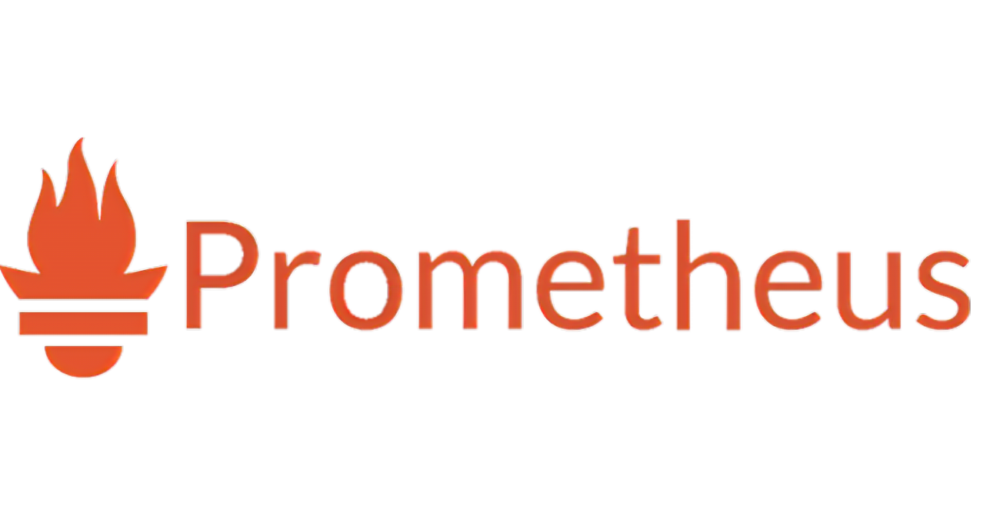

# GitOps

1- what is thwe meaning observability and  monitoring 
2- argocd:
     * what is argocd 
     * what is it use for 
     * what is argocd made of 
     * how to deploy argocd with helm 
     * how does argocd expose metrics  (service monitor) 
     * how does argocd work 

3- Prometheus 
     * what is Prometheus
     * what is it use for 
     * what is Prometheus made of 
     * how to deploy Prometheus with helm from argocd
     * how does Prometheus consume  metrics  (service monitor) 
     * how does Prometheus work 

3- Alertmanager
     * what is Alertmanager
     * what is it use for 
     * what is Alertmanager made of 
     * how to deploy Alertmanager with helm from argocd
     * how to connect Alertmanager with argocd 
     * how to connect Alertmanager with slack
     * how to check alert on alertmanager UI

3- Grafana
     * what is Grafana
     * what is it use for 
     * what isGrafana made of 
     * how to deploy Grafana with helm from argocd
     * how to connect Grafana with prometheus usign a datasource 
     * how to add argocd dashboard in grafana
     * how to create grafana dashboard.

https://foxutech.medium.com/how-to-monitor-argocd-using-prometheus-7f869bd7c83d
https://blog.devops.dev/monitor-argocd-using-prometheus-5a2eb3efd74b
https://argo-cd.readthedocs.io/en/stable/operator-manual/metrics/
https://github.com/argoproj/argo-cd/blob/master/examples/dashboard.json
https://argo-cd.readthedocs.io/en/stable/operator-manual/metrics/

# Argocd

Argo CD is a declarative, GitOps continuous delivery tool for Kubernetes.

### Why Argo CD?
Application definitions, configurations, and environments should be declarative and version controlled. 

Application deployment and lifecycle management should be automated, auditable, and easy to understand.

### How it works
Argo CD follows the GitOps pattern of using Git repositories as the source of truth for defining the desired application state. Kubernetes manifests can be specified in several ways:

- kustomize applications
- helm charts
- jsonnet files
- Plain directory of YAML/json manifests
- Any custom config management tool configured as a config management plugin

Argo CD automates the deployment of the desired application states in the specified target environments.

Application deployments can track updates to branches, tags, or pinned to a specific version of manifests at a Git commit. See tracking strategies for additional details about the different tracking strategies available.

Argo CD is implemented as a Kubernetes controller which continuously monitors running applications and compares the current, live state against the desired target state (as specified in the Git repo). A deployed application whose live state deviates from the target state is considered OutOfSync. Argo CD reports & visualizes the differences, while providing facilities to automatically or manually sync the live state back to the desired target state. Any modifications made to the desired target state in the Git repo can be automatically applied and reflected in the specified target environments.

# -----------------------------------------------------
# Prometheus 

## kube-prometheus-stack

This is a collection of Kubernetes resources that make it easy to operate an instance of Prometheus in a Kubernetes cluster. It is designed to deliver both simple and comprehensive monitoring solutions for Kubernetes clusters.

It provides a predefined set of Grafana dashboards and Prometheus rules combined with community-driven best practices. The stack includes the following components:

- Prometheus: An open-source systems monitoring and alerting toolkit.

- Alertmanager: Handles alerts sent by client applications such as the Prometheus server, carefully de-duplicating, grouping, and routing them to the correct receiver.

- Node Exporter: A Prometheus exporter for hardware and OS metrics with pluggable metric collectors.

- kube-state-metrics: A service that listens to the Kubernetes API server and generates metrics about the state of the objects.

- Grafana: An open-source platform for monitoring and observability that lets you query, visualize, alert on, and understand your metrics.

- Prometheus Operator: Creates/configures/manages Prometheus clusters atop Kubernetes.