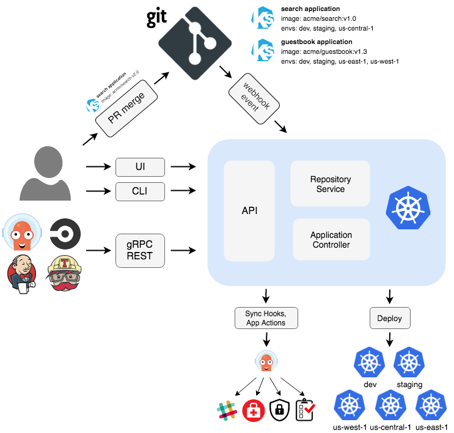

# Phase 12: Setup ArgoCD

## Description 
Objective and activities as previously detailed, with a focus on integrating ArgoCD with the Kubernetes environments and configuring it to monitor the repositories containing the Helm charts for continuous deployment.

## Assigned Tasks 
1- Research on how argocd function 

2- Deploy argocd as IaC
 -  create users (s6student, peter, raoul prince bridget christopher)
 -  create a project call revive 
 -  reate a repo  with git@github.com:DEL-ORG/s6-revive-chart-repo.git, the helm chart is  private so make sure to login with ssh
 - Restict this repo only to the project revive

# Team Report
### What is ArgoCD
ArgoCD is an open-source declarative GitOps continuous delivery tool for Kubernetes. It allows you to maintain, visualize, and manage Kubernetes applications using Git repositories as the source of truth for declarative infrastructure and application specifications. Here's a step-by-step explanation of how ArgoCD works:

In the context of ArgoCD and GitOps, "declarative" refers to the approach of specifying the desired state of a system without explicitly defining the sequence of operations to achieve that state. Instead of describing how to perform actions, you declare what the end result should be, and a tool like ArgoCD takes care of implementing the changes to make the system match the declared state.

## History of ArgoCD
The argo project was started by engineers at Applatix in 2017, which was acquired by intuit in 2018. Intuit started the Argo CD Project to address a need for a fast, reliable continuous delivery service for deploying hundreds of microservices across multiple Kubernetes clusters using Git as the source of truth for not only application source code but for application and environmental deployment configurations.

## How it works
Argo CD follows the GitOps pattern of using Git repositories as the source of truth for defining the desired application state. Kubernetes manifests can be specified in several ways:

- kustomize applications
- helm charts
- jsonnet files
- Plain directory of YAML/json manifests
- Any custom config management tool configured as a config management plugin

Argo CD automates the deployment of the desired application states in the specified target environments.

Application deployments can track updates to branches, tags, or pinned to a specific version of manifests at a Git commit. See tracking strategies for additional details about the different tracking strategies available.

Argo CD is implemented as a **Kubernetes controller** which continuously monitors running applications and compares the current, live state against the desired target state (as specified in the Git repo). 

A deployed application whose live state deviates from the target state is considered OutOfSync. Argo CD reports & visualizes the differences, while providing facilities to automatically or manually sync the live state back to the desired target state. Any modifications made to the desired target state in the Git repo can be automatically applied and reflected in the specified target environments.
## ArgoCD Workflow



## Steps to setup Argocd
### 1. Installing Argocd chart
Used the bitinami/argo-cd repo to install argocd. This was fetched and untared first to make sure that we have the charts downloaded and easy to manipulate. We used the block of code below to fetch/downlaod the these charts from the bitnami repository. 
Note. Remember to update the helm repo before fetching the chart. 
```
EK-TECH-SERVER01:/student_home/s6christopher/Project_Revive/argo-cd# helm repo update
Hang tight while we grab the latest from your chart repositories...
...Successfully got an update from the "stable" chart repository
...Successfully got an update from the "bitnami" chart repository
Update Complete. ⎈Happy Helming!⎈
```

After updating the repo, we used the code below to search for the argocd charts from the bitnami repository
```
s6christopher/Project_Revive/argo-cd# helm search repo argo
NAME                    CHART VERSION   APP VERSION     DESCRIPTION                                       
bitnami/argo-cd         3.1.9           2.3.3           Argo CD is a continuous delivery tool for Kuber...
bitnami/argo-workflows  1.1.3           3.3.1           Argo Workflows is meant to orchestrate Kubernet...
```
We selected bitnami/argo-cd, fetched and untared it to be able to make some changes from the working directory. This was done using the code below.

```
helm fetch --untar bitnami/argo-cd 

chmod -R 777 .  #this changes permissions to be able to save any changes
```

Go to the value.yaml file under "server" and change the service type to Nodeport, to be able to expose the application using Nodeport. This was originally set as ClusterIP. You can not expose the app to the browser if this is not changed before installing it.

### Create namepace
Before instaling argocd, we create a specific namespace to deploy argocd. This was argocd-revive
```
kubectl create namespace argocd-revive

kubens argocd-revive

```
### Installing argocd 

We then installed the app using the command below:

```
helm install argocd .
```
After installing, check if the pods are running.

```
kubectl get pod   -owide

kubectl get svc

kubctl get node -owide
```
Get the node on which the app is running and grab the port assigned to the nodeport, and check the browser if the app is running. Use this command to decrypt the  User and password.
```
echo "Username: \"admin\""
echo "Password: $(kubectl -n argocd-revive get secret argocd-secret -o jsonpath="{.data.clearPassword}" | base64 -d)"
```
Make sure to change the password the first time you login the argocd UI. 


### Setting up the CLI
Go to the argocd github [page](https://github.com/argoproj/argo-cd/releases/tag/v2.9.7) and select the latest release on the right side. 

Scroll down to Assets and select "argocd-linux-amd64" as shown in the image below. 


- Right click and copuy link
- Go to the terminal and wget and paste the link , -O argocd (this will keep the name short)

```
wget https://github.com/argoproj/argo-cd/releases/download/v2.9.7/argocd-linux-amd64 -O argocd
```
This will download the argocd linux CLI. But this needs to be moved to the local/bin and must be executable

```
mv argocd /usr/local/bin   #this moves to local/bin

chmod +x /usr/local/bin /argocd  #this makes it executable
```


This is now executable, and you can run argocd as a CLI on the terminal using the command argocd.
Forexample, if you run argocd account -h, it will show you all the different arguments

```
EK-TECH-SERVER01:/student_home/s6christopher/Project_Revive# argocd account -h
Manage account settings

Usage:
  argocd account [flags]
  argocd account [command]

Available Commands:
  bcrypt          Generate bcrypt hash for the admin password
  can-i           Can I
  delete-token    Deletes account token
  generate-token  Generate account token
  get             Get account details
  get-user-info   Get user info
  list            List accounts
  update-password Update an account's password
```
### Logging in into the CLI
Just like we logged into the UI, we need to log into the CLI using the node IP address and the service port of the nodeport. However, we need to add a flag --insecure, just like we logged in the UI
```
argocd login 198.199.83.68:31179 --insecure

username: admin
password: phase12revive
```

After successfully loging in, we can now commands like argocd account cluster to see which clusters our UI is running from.
```
argocd cluster list
```

You can also update the password from here istead of doing it manually from the UI, this can be done using thhe command below.

```
argocd account update-password
```


### Avoiding the password to change
If the password is not set to be fixed, it will change everytime the helm chart is upgraded to deploy latest changes, therefore, you have to set the admin password in the secret file so that it stays fixed. 


### Adding more clusters to argocd
You can have multiple clusters to the context, to be managed by argocd, for example you can have the development cluster, the qa-cluster and the production cluster, and all can be managed by argocd at the same time. 
use the command below to add more cluster, you need the region and the name of the cluster.

```
aws eks update-kubeconfig --region eu-west-1 --name qa-cluster
cat .kube/config #this shows you the different clusters u have
```
These configures the cluster. To add the configured clusters to argocd, use the command below

```
argocd cluster -h #helps to see arguments
argocd cluster add [context] #add the context for the desired cluster

argocd cluster list  #this should show you all the clusters added to argocd. 
```
## Adding users from the CLI

In order to add users, we need to modify the "argocd-cm" configmap file under data. 

```
apiVersion: v1
kind: ConfigMap
metadata:
  name: argocd-cm
  namespace: argocd
  labels:
    app.kubernetes.io/name: argocd-cm
    app.kubernetes.io/part-of: argocd
data:
  # add an additional local user with apiKey and login capabilities
  #   apiKey - allows generating API keys
  #   login - allows to login using UI
  accounts.alice: apiKey, login
  # disables user. User is enabled by default
  accounts.alice.enabled: "false"
```

### Setting passwords for the new users
Here you can see all the new users

```
EK-TECH-SERVER01:/student_home/s6christopher/Project_Revive/argo-cd# argocd account list
NAME         ENABLED  CAPABILITIES
admin        true     login
bridget      true     login
christopher  true     login
confidence   true     login
peter        true     login
prince       true     login
raoul        true     login
s6student    true     login
```

To se the passwords for these users, here is the command

```
argocd account update-password --account christopher --current-password phase12revive --new-password s6christopher
argocd account update-password --account confidence --current-password phase12revive --new-password s6confidence
argocd account update-password --account peter   --current-password phase12revive --new-password s6peterrevive   
argocd account update-password --account prince  --current-password phase12revive --new-password s6princerevive  
argocd account update-password --account raoul   --current-password phase12revive --new-password s6raoulrevive    
argocd account update-password --account s6student  --current-password phase12revive --new-password s6student 
argocd account update-password --account bridget  --current-password phase12revive --new-password s6bridget
```

### Managing Permissions for the created users
This link describes argoc [permissions](https://www.linkedin.com/pulse/kubernetes-practice-user-management-rbac-argocd-qu%C3%A2n-hu%E1%BB%B3nh/) perfectly. 

When new users are created, the defualt argocd setting grants them "read-only" permission. Even if they can log into the UI, they dont have permission to do anything. 
```
apiVersion: v1
kind: ConfigMap
metadata:
  name: argocd-rbac-cm
  namespace: argocd
data:
  policy.default: role:readonly
```

The grant them permissio, we have to modify the config-rbac-cm yaml file and set the desired permisions. 
We will define permissions in the field policy.csv with the format.

```
apiVersion: v1
kind: ConfigMap
metadata:
  name: argocd-rbac-cm
  namespace: argocd
data:
  policy.default: role:readonly
  policy.csv: |
   p, <role/user/group>, <resource>, <action>, <object> 
```
   - The <role/user/group> is the name of the role or user or group.
   - Resources: clusters, projects, applications, repositories, certificates, accounts, gpgkeys, logs, exec
   - Actions: get, create, update, delete, sync, override, action/<group/kind/action-name>
#### Example:
```
apiVersion: v1
kind: ConfigMap
metadata:
  name: argocd-rbac-cm
  namespace: argocd
data:
  policy.default: role:readonly
  policy.csv: |
    p, hanli, applications, action/apps/Deployment/restart, default/*, allow 
```
  - This shows that the user "hanli" has access to the applications, and they can deploy/restart in the default project (or in another created proect), and they are allowed.


However, if you have many users, this would make the configmap messy. The best way is to create a role, and assign it to the corresponding individuals as shown below

```
apiVersion: v1
kind: ConfigMap
metadata:
  name: argocd-rbac-cm
  namespace: argocd
data:
  policy.default: role:readonly
  policy.csv: |
    p, role:deployment-restart, applications, action/apps/Deployment/restart, default/*, allow

    g, christopher, role:deployment-restart
    g, peter, role:deployment-restart
    g, confidence, role:deployment-restart 
```

### Creating Project
To create project, we use the following command
```
argocd proj create revive
```
Note that only admin has permission to create this. If other users want to create project, they need the right permissions, otherwise they will ebe denied. This can be set in RBAC.

### Adding a Github repo
Since it is a private repo, You have to include the ssh key.
```
argocd repo add git@github.com:DEL-ORG/s6-revive-chart-repo.git 
--ssh-private-key-path /path/to/private-key
```

### Creating an App from the cli

```
argcd app create revive 
--repo [git repo]
--path revive 
--dest-namespace [namespace]
--dest-server https://kubernetes.default.svc
```

### Synchronize the app
Instead of sync the app from the UI, you can sync it from the cli using the command below. 
```
argocd app sync revive
```