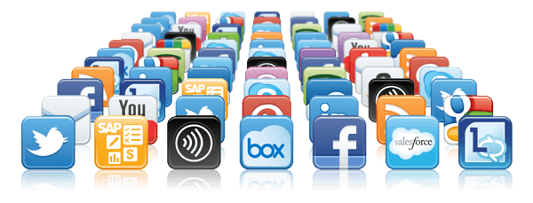

## An Application

### What is an application??

Is a computer software package that performs a specific function for an end user or another application based on carefully designed feature.

*Simple language:* it means application are just simple software that solve a particular need for either users also called customers or other applications. 

Every application on my phone is there to serve a specific need. 

Eg. facebook application help user to connect around the world. Here are examples of applications we use everyday. 

## Types of Applications
As devop engineers, we deal with 2 types of applications: 
1. Stateless application:

Is an application program that does not save client data generated in one session for use in the next session with the client.

Each session is carried out as if it was the first time and responses are not dependent upon data from a previous session. 

This means this application doesnt require **"volume"** and no **database.**

2. Stateful application. 

Stateful applications save data to persistent disk storage for use by the server, bu client and by the other applications.

An example of a stateful application is a databse or key-value store to which data is saved and retrieved by other applications. 

Therefore, **You need to persist a volume. You need a database.**

