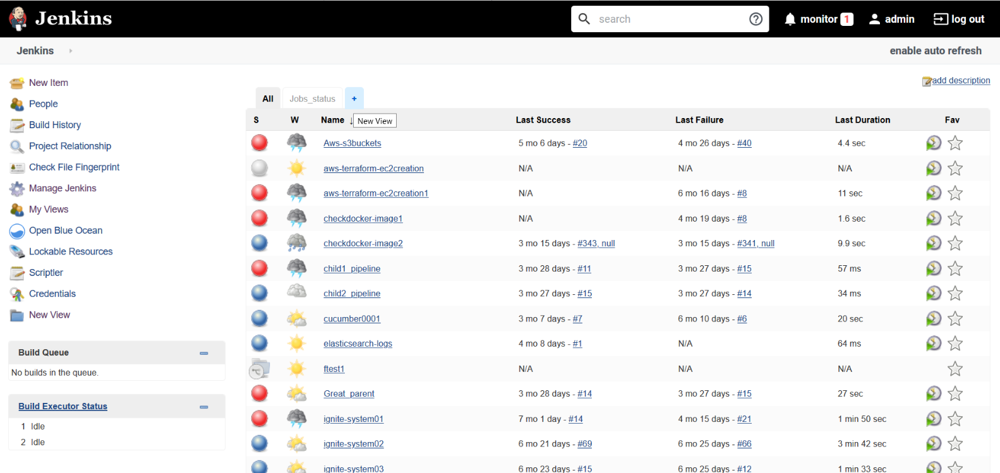
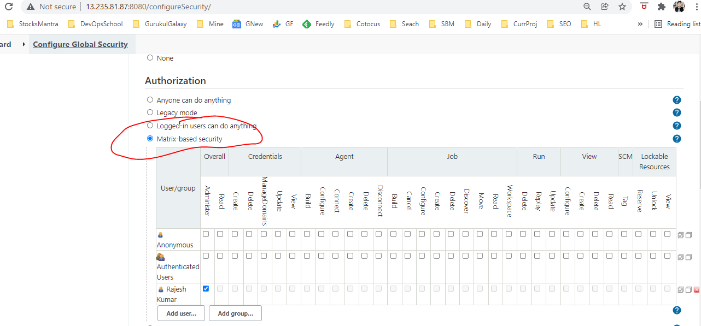
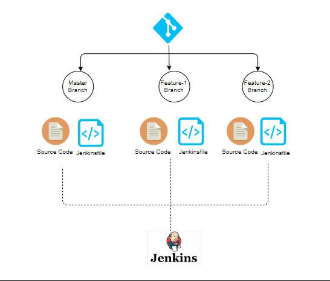

# Jenkin - CI/CD
he Jenkins dashboard is the central hub for managing and monitoring continuous integration and continuous delivery (CI/CD) pipelines. Here is a summary of the main parts of the Jenkins dashboard:



## Navigation Bar:
Located at the top of the dashboard, it provides access to various Jenkins features, such as Home, New Item, Build Executor Status, Manage Jenkins, and more.

## Job/Build List:
Displays a list of jobs or builds configured in Jenkins. Each job represents a specific task or project, and the build history shows the status of previous executions.

## Job Status:
Indicates the current status of each job or build, such as success, failure, or in-progress.

## Build Executor Status:
Shows the status of Jenkins build executors, including the number of available and busy executors. Executors are responsible for running jobs.

## Build Queue:
Displays a list of jobs that are waiting to be executed. Jobs are added to the queue when there are no available build executors.

## Side Panel:
Contains links to different Jenkins functionalities, such as the job's workspace, build history, configuration, and more.

## Console Output:
Shows the real-time console output of the currently running job. This is helpful for debugging and understanding the progress of a build.

## Build Parameters:
If a job requires input parameters, they can be specified here before triggering a build.

## Build Trends and Statistics:
Graphical representations of build trends and statistics, such as success and failure rates over time. This helps in analyzing the performance of jobs and identifying patterns.

## Manage Jenkins:
A section that allows administrators to configure global settings, manage plugins, and perform other system-level tasks.

## Search Bar:
Enables users to quickly search for specific jobs or items within Jenkins.

## User Menu:
Provides options for managing user profiles, logging in or out, and accessing user-specific settings.

# Jenkins Configuration
This is managed through "Manage Jenkins" bar. 

Go to manage jenkins -> System
- This shows the home directory (default home directory )
- pwd -> var/lib/jenkins 

Making the text bold:
 - You can do this by enabling html in formater instead of plain text

 Number of executors 
   - Thiis ther number of jobs it can handle

## Installing Plugins

In Jenkins, plugins are extensions that enhance the functionality of the core system. They allow users to add specific features, integrations, or tools to customize Jenkins according to their needs. Plugins enable Jenkins to support a wide range of technologies, tools, and processes, making it a versatile and extensible automation server. Here are some key aspects of Jenkins plugins:

## Git Plugin:
Allows Jenkins to integrate with Git repositories. It provides functionality for checking out source code from Git, triggering builds based on changes in Git repositories, and more.

## GitHub Integration Plugin:
Enhances integration with GitHub by providing features such as triggering builds on pull requests, updating GitHub commit statuses, and notifying GitHub of build results.

## Pipeline Plugin:
Introduces a domain-specific language (DSL) for defining continuous delivery pipelines as code. It enables users to express their build, test, and deployment processes in a scriptable manner.

## Docker Plugin:
Facilitates the integration of Jenkins with Docker. It allows users to build, push, and run Docker containers as part of their CI/CD pipelines.
## Others
 - sonarqube - for code inspection
 -  shell - changing the shell jenkins is using
 - Slack - for notification
 - Email extentions

## Tools
Here you can install different tools you need. If you install a plugin, and that plugin is a tool, it will show as a tool
- Git
- sonarscanner
- sonarqube
- maven builder

## Plugin
- This is where you install more plugins


## Credentials

- This has all the different credentials for all tools

## User
This manages the users of jenkins

- Create User - this creates a user and password

# Manage User Access

Jenkins  Role-Based Access Control (RBAC)

- Go to plugin 
- Install plugin called "Role-bases Authorization Strategy"
- To configure the plugin, go to security
- Authorization -> Project-based Matrix Authorization Strategy"
- Add user -> search admin -> it will pop up -> Give admin Overall Previllege -> Apply -> Save
- DO THIS FIRST OR ELSE YOU WILL BE LOCKED OUT OF JENKINS
- If you try logging into as the other user "john, they wont have any previllege after they login
- Go back as admin - add user "john", -> Select the previlleges you want to give to john
- Select or unselect any previlleges that you want new users to have or not have

# Add Build Tools in Jenkins
- These are specific tools that jenkins uses to conduct specific tasks
- Eg docker to build images, maven to build javacode, npm etc

# User Management in jenkins

- Start by Creating user
- Go to the "settings" icon on the user and manage all information that you can update
- you can see status, builds, configure, my views, delete. Select any of these to manage the user 

# Create Folder in Jenkins
- To be organized, we create jobs into folders
- go to "New item" -> Add Name -> Select "Folder" -> Apply and Save
- General -> Display name -> Put the same name you created -> Apply and Save
- A folder is created
- Inside this folder, we can now create jobs
- Company will have different Folders for Development, Devops, QA and Production
- Jobs in each area will created under the respective folders

# Create Freestyle Job 

In Jenkins, a Freestyle project or job is a traditional and straightforward way to create a build or automation task without using the more modern Jenkins Pipeline syntax. Freestyle jobs provide a graphical user interface (GUI) for configuring and customizing different aspects of the job. This approach is suitable for users who prefer a point-and-click interface for setting up their build and deployment processes.

- Go to "New Item" -> enter job name -> freestyle project

- Go to build step -> type in the scrypt that you want to run - apply and save
- Build now to execute the build 

# Create a pipeline job
- new item -> job name -> pipeline 
- Enter pipeline -> apply and save
- build now

- This will build all the different stages of the pipeline
- and the dashboard shows you the progress of the pipeline


# Multibranch pipeline job

The purpose of a Multibranch Pipeline in Jenkins is to automate and manage the continuous integration and continuous delivery (CI/CD) process for projects with multiple branches in their version control system. It is particularly useful for organizations that follow a branching strategy, such as GitFlow, where different branches represent different stages of development (e.g., feature branches, development branches, release branches).


- new item -> job name -> Multibranch pipeline
- Display name -> enter branch source (Git) 
- enter the URL of the Gip repo (it should have a jenkins file) 
- Clone https (unless jenkins has our ssh key)
- If the repo is private, we have to supply credential to jenkins
- Script path (enter the path of your jenkinsfile)

Jenkins will detect all branches and build them. When you have a team with 10 - 15 developers, working on multiple branches, jenkins picks up all the changes and build these branches. 

- You can also exclude branches on the mult-branch pipeline

# Jenkins Home Directories
The Jenkins home directory is the location on the file system where Jenkins stores its configuration, plugins, job data, and other important information. The exact location of the Jenkins home directory depends on the operating system.

Here are the default locations for Jenkins home directory on different operating systems:

- Linux:
The default Jenkins home directory on Linux is often located at
```
 /var/lib/jenkins
```
Within the Jenkins home directory, you will find subdirectories such as:

- jobs: Contains configurations and data for each Jenkins job.
- workspace: The working directory where Jenkins performs builds.
- plugins: Stores Jenkins plugins.
- secrets: Holds sensitive information, such as security-related data.
- users: Stores user configurations and authentication data.

Everything you see on the jenkins CLI (backend) can be seen in the UI (console)  and viseversa.


