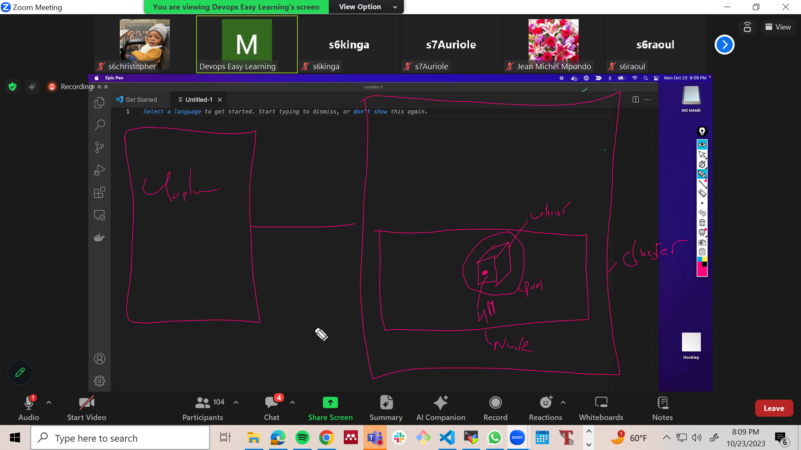

# Kubernetes 

### Container Orchestration tool
it can scale, automate, deploy, contenizarize
To orchestrate means it does everything, scaling, automating, deploying, and managing containerized applications. 

## Components of K8
We have 2 components:
   - The master / control plae
   - The cluster / Node group
The master controls the cluster.

### Terminologies 
You can have K8 on premise, or you can have it online. When it is on-premise, the components are called master and cluster. However, when you have it virtually, it is called the control plane, and node group. 
On-premise  = Physically present. 
Cloud  = Virtual / online

### Administer K8.
If your K8 is on premise, it means you are responsible for physically buying and installing the k8 infrastructure. If anything happens, you are responsible for fixing it and you control everything. This is called administering k8. 

If someone asks you "do you administer k8? and you say yes, it means you have just told them your k8 is on-premise. 

### In-cloud K8
When K8 is in the cloud, the cloud provider will create the whole infrastructure. The provider will manage the control plane (master) and the devOp will manage the node group (cluster). 
The cloud provider will always guarantee a working control plane if anything happens. However, you are responsible for your node group. If any of the nodes die, the cloud provider will spin new nodes for you. 

### Consuming k8
When k8 is in the cloud and you didn't build the infrastructure, we say you **consume k8**. This is the difference between administering and consuming. Administer on premise, consume on cloud.

### K8 providers:
Amazon Web Services (AWS): AWS offers Amazon Elastic Kubernetes Service (EKS) for managing Kubernetes clusters on their cloud platform.
Google Cloud Platform (GCP): GCP provides Google Kubernetes Engine (GKE) for running and managing Kubernetes clusters.
Microsoft Azure: Azure Kubernetes Service (AKS) is Microsoft's managed Kubernetes offering.
IBM Cloud: IBM Cloud Kubernetes Service is IBM's managed Kubernetes solution.
Oracle Cloud: Oracle Cloud Container Engine for Kubernetes (OKE) is Oracle's managed Kubernetes service.
DigitalOcean
Alibaba Cloud also offers managed Kubernetes services.

## The workflow

**The application -> Container -> Pod -> Node -> cluster -> Control Plane**
The application lives inside the container, the container lives inside the pod, the pod lives inside the node, the node lives inside the cluster, the cluster is controlled by the control plane
Node is a common virtual machine. 

Cluster is an envelope around the node

pod is an envelope around the container 

