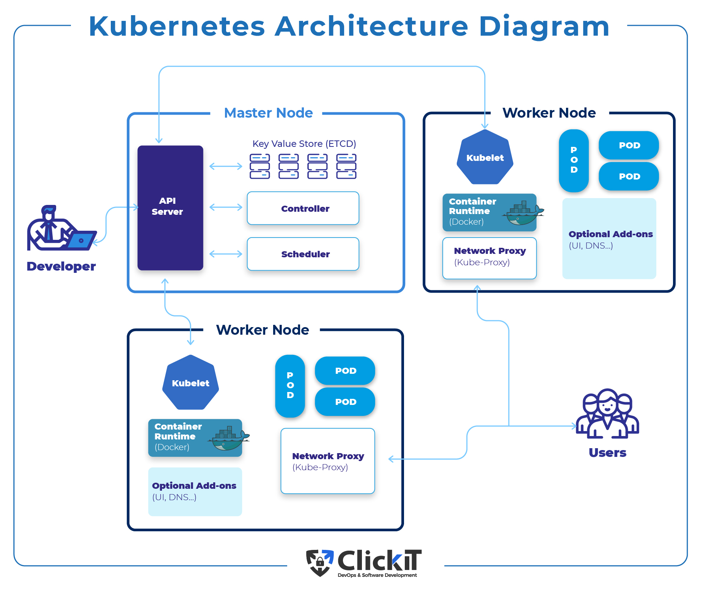
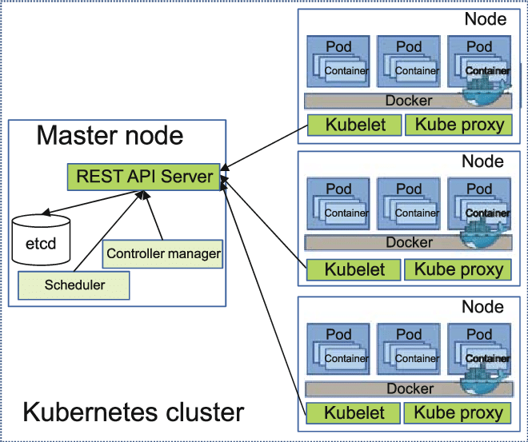
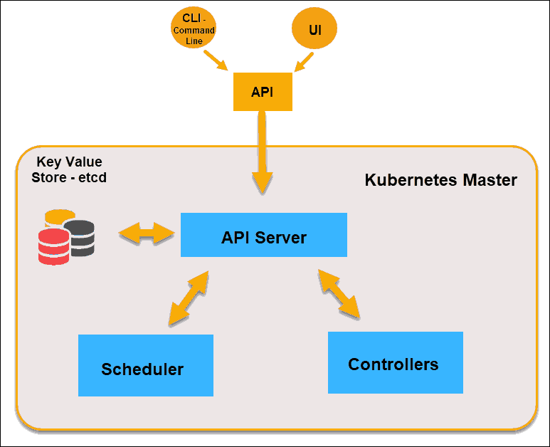
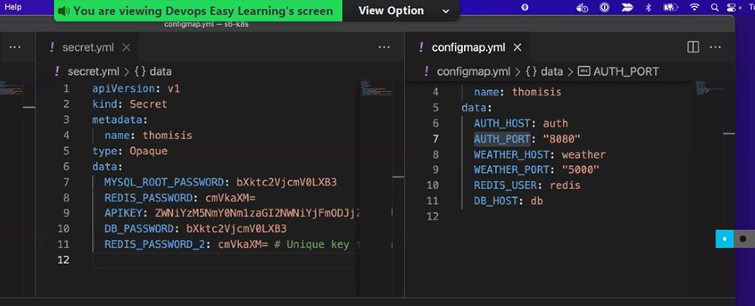
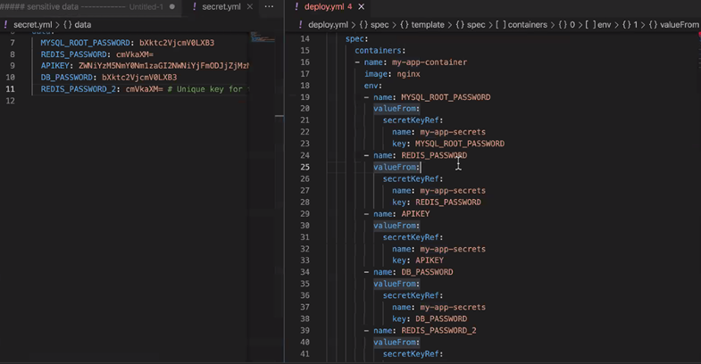
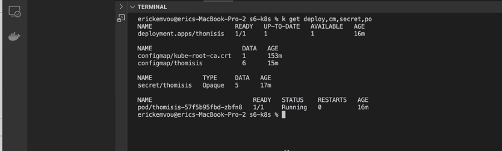
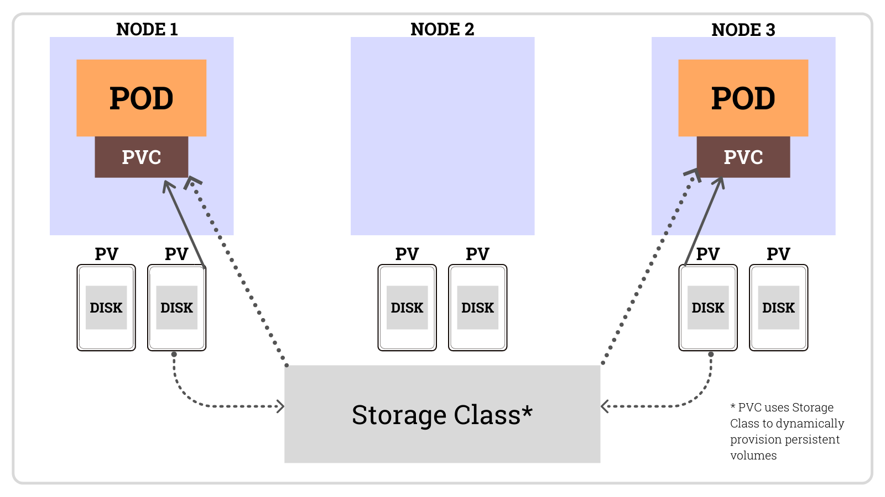

# Kubernetes 
Here is the link to the kubernetes [powerpoint](https://docs.google.com/presentation/d/1WxApP_IwQOfjdVjHrLKoOrlzZXwbWM4M/edit#slide=id.g142824cfa6a_1_26)

### upgrading k8s
You cant upgrade k8s from one version to another skipping versions. Forexample from 1.26 to 1.28. You need to go one version at a time. From 1.26, to can only go to 1.27. Also, you cant go back to old versions if you upgrade.


### K8s is a Container Orchestration tool
Meaning that it can deploy, manage, scale up and down containers automatcally with no human intervention. 

To orchestrate means it does everything, scaling, automating, deploying, and managing containerized applications. 
## Compare Docker-Compose Vs k8s
### Docker-Compose
- Deploy multiple containers on a single virtual machine
- You have to manually scale up or down containers when needed
- Mostly used internally for development and testing area
- Downtime expeted at deployment (kills a container before launching a new one, hence the application goes down during this waiting period)
- lacks self-healing capacity
### Kubernetes
- Deploys containers (pods) on multiple virtual machines (nodes)
- Automatically scales containers (pods)
- Used in all areas (development,testing, pre-production, production)
- Zero to near-sero downtime at deployment (starts a new container before killing one, helps the app to be running at all time)
- High availability of application (autoscale gives high availability)
- self healing (restarts containers if stopped)

## Components of K8
We have 2 components:
   - The master / control plane
   - The cluster / Node group
The master controls the cluster.


### Terminologies 
You can have K8 on premise, or you can have it online. When it is on-premise, the components are called master and cluster. However, when you have it virtually, it is called the control plane, and node group. 
On-premise  = Physically present. 
Cloud  = Virtual / online

### Administer K8.
If your K8 is on premise, it means you are responsible for physically buying and installing the k8 infrastructure. If anything happens, you are responsible for fixing it and you control everything. This is called administering k8. 

If someone asks you "do you administer k8? and you say yes, it means you have just told them your k8 is on-premise. 

### In-cloud K8
When K8 is in the cloud, the cloud provider will create the whole infrastructure. The provider will manage the control plane (master) and the devOp will manage the node group (cluster). 
The cloud provider will always guarantee a working control plane if anything happens. However, you are responsible for your node group. If any of the nodes die, the cloud provider will spin new nodes for you. 

### Consuming k8
When k8 is in the cloud and you didn't build the infrastructure, we say you **consume k8**. This is the difference between administering and consuming. Administer on premise, consume on cloud.

### K8 providers:
There are more than 50 cloud providers, but below are the top 5 providers. Even though it is the same k8s, they differ in flavors. Here are the flavors based on the company. 


- Amazon Web Services (AWS): AWS offers Amazon - Elastic Kubernetes Service (EKS) for managing - Kubernetes clusters on their cloud platform.

- Google Cloud Platform (GCP): GCP provides Google Kubernetes Engine (GKE) for running and managing  Kubernetes clusters.

- Microsoft Azure: Azure Kubernetes Service (AKS) is Microsoft's managed Kubernetes offering.

- IBM Cloud: IBM Cloud Kubernetes Service is IBM's managed Kubernetes solution.

- Oracle Cloud: Oracle Cloud Container Engine for - Kubernetes (OKE) is Oracle's managed Kubernetes - service.

- DigitalOcean

- Alibaba Cloud also offers managed Kubernetes services.

## The workflow

**The application -> Container -> Pod -> Node -> cluster -> Control Plane**

The application lives inside the container, the container lives inside the pod, the pod lives inside the node, the node lives inside the cluster, the cluster is controlled by the control plane
Node is a common virtual machine. 

Cluster is an envelope around the node

pod is an envelope around the container 

## The Node
These are the 3 major components of the node. They have to be installed on every single node. 


  
  ## This is a kubernetes cluster. 


 ### Kubelete: 
 This is an agent of k8 and its the one running the show. Over sees all processes in the cluster. It works for me. I think i want to know inside the node, kubelete gives me the information.(how many pods do u have, are they running, is there a problem) This is the single point of contact inside the node. If you lose contact with kubelete, you have lost the node. 

### Docker:
 Needed in each node to make  containers. This is an agent for docker-engine to create containers in each node. 

### Kubeproxy:
As long as you here the work "proxy" in IT. It has something to do with networking. kube proxy is a pod that manages networking. If you deploy the application and you see the app in the browser, its the proxy that exposes the app the external.Its a pod and not an agent. If the proxy is not working, your app wont connect to the network. 

If the control plane controls the cluster, and the cluster is just an envelope around the node, therefore, the control plane controls the node not the cluster. 

Also, if the single point of contact in the node is kubulete, therefore control plane talks or communicates with kubelete. 

The cluster is the backend, the human being cant talk to the cluster. The human being talks to the control plane, and the control plane talks to the node (cluster). 

Forexample, UI (frontend)-> API -> Database(backend).

Here, the control plane is the UI and the node is the backend. 

### A Pod
In simple terms, a pod is a collection of containers, its just an envelope around a/containers. 
A "pod" is the smallest deployable and scalable unit in the platform. 

It's a fundamental concept and represents a single instance of a running process in a cluster. 

A pod can contain one or more containers, which are tightly coupled and share the same network namespace and storage volumes. 

In most cases, pods are used to run a single container, but in scenarios where multiple containers need to work closely together, they can be grouped within the same pod.

You need atleast one running container to have a pod. 

**However**, Best practice, dont over load one pod with a lot of containers. From 1 to 3 is okey, but over 3 in making the pod too heavy. You can create another pod and put the other containers, and make the 2 pods communicate if neccesary. 


## The master (Control Plane)
The control plane, also known as the master node, is the central management and control unit of a Kubernetes cluster. It is responsible for orchestrating and managing the entire cluster's operation. 

The control plane consists of several core components:

1. **Scheduler:** Its in charge of pod scheduling. This tells where the pod will be created. Which node to create the pod. etc. 
The scheduler assigns work (pods) to nodes based on resource requirements, constraints, and other policies.

2. **Controller manager:** Controls and manages everything about the cluster. 
The controller manager watches the state of the cluster through the API server and ensures that the desired state, as defined in various controller loops (e.g., ReplicationController, Deployment), is maintained.

3. **etcd:** This is a database. it stores information.  etcd is a distributed key-value store that stores the entire state of the cluster, including configurations and data. It acts as the cluster's source of truth.

4. **API Server:** None of the kubernetes components talk to each other, because they were developed/written in different language. Therefore, The ApI server is there to make the translation to ensure communication between components like docker, kubelet, etcd, scheduler etc. 


Forexample, if i want to create more pods, I talk to the controller manager, which sends a message to the scheduler through the APi server, the scheduler looks for the node with less pods and create a pod on that node (talks to kubeletes to find which node to create a pod). kubetes talks back to scheduler through the ApI server. 

## Kube config
Kubernetes has maximum security. We dont directly talk to the API-server. The API on our virtual machine talks to the API-server, using a key called kube-config key. When you create an account, k8 gives you the config key for authentication. 


The key is stored at this path: HOME/.kube/config

If you cant connect to k8s, 2 things you need to do before asking your collegue:

   1. Check if you have the key.  cat ~/.kube/config

   2. Verify if you have the correct key. This is because the key is rotated every 2-3 weeks, for security reasons. (copy your key put it in one file, copy the provided key and put it in another file, use vscode to compare the 2 files. vscode will show u the differences between the 2 files)
### Keypair
Somethings is equal to something. It is used to store important keys to access the cluster.  


In Kubernetes, a "Keypair" and "Value" typically refer to key-value pairs within resources like ConfigMaps and Secrets. These key-value pairs are used to store and manage configuration data, sensitive information, and other settings in a structured format. 
##### Key-Value Pair:
A key-value pair is a fundamental data structure where data is organized into pairs of keys and their corresponding values. In Kubernetes, key-value pairs are often used to represent configuration settings or data that applications, containers, or pods need to access. Each key is a unique identifier, and its associated value contains the actual data.

# OBJECTS
Objects are all components that makes up a pod. The pod consumes all of them to be functional. These are called the kubernets API objects or k8 objects. Here are the objects broken down. 

### Note: All objects are written in yaml file

## 1. ConfigMap
#### PROBLEM: How do we deal with non sensitive data in K8S? How does Docker-compose fail us?
Docker-compose doesnt separate/split sensitive and non-sensitive information/data in the environment variables, such as user, passwords, etc. Some of the env variables are secrets/sensitive while other are non-senstive. 

**Non-sensitive data:** Data if someone (hacker) gets hold of it, they cant hurt you.
Forexample, if someone accesses your username for you bank account, they cant access your account since they dont have the password. The username is categorized as non-sensitive. 

The good news is that, in k8s, the 2 datas are stored separetely in 2 different objects. In k8s, we manage non-sensitive data using something called a config-map aka CM.



**A ConfigMap is a Kubernetes resource that allows you to store configuration data as key-value pairs. ConfigMaps are typically used to store non-sensitive configuration information that can be injected into containers as environment variables or mounted as files. They are commonly used for setting application configurations, environment variables, or properties.**

## 2. Secret

**Sensitive Data** : This is data that when accessed can hurt us. This include passwords etc. 
In k8s, this type of data is stored ina  different object called secret. 
This data is stored in Base64 encode format, and k8 will automatically translate it. 

This means you go to the base64 website, paste your password and base64 will give you characters that are equal to your password. Enter this in k8. For config-map, the data is stored in plain text. In k8s, we manage sensitive data using something called secret.

**A Secret is another Kubernetes resource that stores sensitive or confidential data, such as passwords, API keys, and TLS certificates, as key-value pairs. Secrets are designed to keep sensitive data secure and are typically mounted as files or injected as environment variables into containers in a way that is more secure than ConfigMaps.**
### Point to note
The k8 deployable file depends on the secret file but it needs some information such as environmental variables to deploy. In the secret file, we store all the secret data as environmental variables.
For secret infor, only the **KEY** to the information will appear in the deployable file, and not the actual **VALUE** of the secret. The deployable file talks to the secret file to access the actual value.



for example, when we echo an enviromental variable in the deployable file, the response will be the **'value"** of that variable in the secret file. When you echo the env variable in the deployable yaml variable, spits the actual decoded data in the secret 
```
echo $REDIS_PASSWORD
my_secret_password
```
It wont give us the base64 encoded response cmVkaXM= , it will give us the actual password. 

**The conclusion here is that k8s consumes secret object and configmap as environment variable in a form of key-value pair. we dont have to enter them as env manually as we do in the docker-compose file**

**Also, the pod needs secret and configmap as objects to run**

2 different objects can carry the same name. For example, the configmap and the secret can both have the same name. 

## Inspecting pod objects
Using the command below, we can inspect the status and properties of each object in the pod. 
```
kubectl get deploy, cm, secret, po
```


We can see that there is one deployment file expected, and it's running.

We can see the configmap with data 6. Meaning that there are 6 environmental variables in our configmap.

We can also see that there is a secret object, with 5 environmental variables.

We can also see the pod, and it's ready and running. 

## 3. Deployment file 
This is a YAML file that is like the docker-compose file, it refers to the config map and the secret after they have been created (separately). This file collects the information from this dependant file (sec and cm), to create a pod. Therefore, ***the deployment gives birth to the pod***

In order for the pod to be created, the configmap and secret have to be created or deployed before the deployment file is run. This is like building a car, the car cannot be driven before all the parts are put together, and the driving comes last after all parts have been built and assembled together. 

# 4. The Scheduler and Daemonset 
It's in charge of pod scheduling. This tells where the pod will be created. Which node to create the pod. etc. 
The scheduler assigns work (pods) to nodes based on resource requirements, constraints, and other policies. 
The scheduler works like a human being, if the node has less pods, it will schedule all the new pods in the node with less pods. For example, if I have 6 nodes, below, the scheduler will put all pods in node 3 (red pods) as shown below. 


Each pod to be scheduled is responsible for going to each node and collecting the metrics of that node (CPU, Memory, Storage and Logs) to the datacenter, in order to know its status and capability before any other pods are added. 


However, if we rely on the scheduler to distribute these pods to collect the metrics, we cant get information of all nodes since pods will only be scheduled on nodes with less pods. In order to solve this problem, we have to replicate the same pod to go to all nodes so that it collects the metrics. 


This is where we need a daemonset to make sure that a copy of a pod to be placed on every single node. The deamonset is the technology that helps us to replicate the pods to be placed at all nodes to collect their metrics. 

The deamoset is also a file just like the the configmap and secret file. We dont need to tell the deamonset file how many replicas of the pod to create, it will automatically create the same number of copies as the number of the nodes we have in the k-cluster. D-set makes sure that a copy of the pod runs on every single node. 

Here we see datadog node agent pod on repeated or replicated at each one of the 3 nodes. Also, a kube-proxy is another type of a deamonset since it is a pod that is found in each node in the cluster. 


## Job & CronJob in Kubernetes

From linux, we learnt that we can use cronjob to schedule repeated tasks in the future. For example, turn off or stop my instance every 10pm. In kubernetes, if i want to transfer data from pod (volume of the pod) to a datacenter to be safe in case a node is lost. we have the data safe in the datacenter. 

In I.T, when an activity is done repetitively (from time to time) it is called a task. 


For example, I want to move data from this pod to a database at 9pm everyday, we set a cronjob. 
We have 2 jobs.

   1. Cronjob: Used for repeated tasks at specific time repeatitively.

   2. Run to completion job (Job): This is used to run a task to completion and stop. 


Here we see that the job-thomisis ran once and never ran again, but cronjob kept running repeatitively. 

## Replicaset for Reliability
Pods are ephemeral - this means that they can die at any given point of time. This interferes with the high availability of the application because if the pod dies, the application will die.  If you are using the application on your phone and the pod dies, the app will crush. 


When you place a replicaset on the pod, which is a technology that gurantess that a specific number of pods running in our k8s cluster. 

***Purpose:*** ReplicaSet is an object that maintains a set of identical pods to ensure a specified number of pod replicas are running at any given time.

***Usage:*** It's used for stateless applications where maintaining a specific number of identical pods is essential for reliability and scaling. If a pod fails, the ReplicaSet replaces it to maintain the desired replica count.

***Scaling:*** It ensures a specific number of replicas are running, irrespective of the number of nodes in the cluster.

Since the replicaset ensures a specific number of pods, even when you delete a pod, k8s will automatically replace the deleted pod, to meet the required number of pods. The number of replicasets is defined in the deployment file under replica (number of pods). 

If one pod dies, the application will not die, because k8s will automatically replace the pod. 

# Service File
An abstract way to expose an application running on a set of Pods  as a network service. Service helps to Make application visible on the browser.

### Accessing the application on a browser.
A service is a war to access the application from the browser. There are 3 ways of accessing the application in k8s. 
1. The Nodeport
2. Cluster IP
3. Load balancer

The type of service is defined in the service yaml file under "spec" includding the port information.


## Nodeport
When you use a nodeport to expose the node, k8s will go on every single node, and open the same port. This port has 5 digits. If you have the IP addres of each node, you will see the application in the browser (IP address:portnumber). You can access every single node using the same port as long as you have hte node ip address. 
**Port Range:** The NodePort is a port in the range of 30000-32767 by default. Users can also specify a port number in this range when defining the service. using the spec below in the service file. 
```
targetPort: 80
nodeport:31000
```
Here k8s will assign this port number to as your nodeport number to all nodes. 

K8 will deploy a service outside the nodes, and the service communicates with the nodes. 
NodePort can provide rudimentary load balancing. This is because it exposes the service on each node, and external traffic can be balanced across these nodes.


Forexample, we have 2 nodes running in our kubernetes cluster both supporting the same application. we can view list these nodes using the code below.
```
kubectl get node
```
Also, to view the service used to access these nodes, we use the command below.
```
kubectle get svc
```
This will return the follow results showing the nodeport as the service used, and the port that k8 created to access the application. Uisng this port together with the ip address of any of the nodes, you can acess the application in the browser.


Below is the application we have running in the cluster accessed using the ip address of the node plus the nodeport number. 


## Load Balancer service 
Comapared to nodeport where the service is placed inside the cluster and open a port on each node,for the load balancer, the cloud provider will provide an external service (service outside the cluster) that will manage the traffic between the nodes. 


If you administer K8s, you cannot have load balancer(unless you use metalLB), LB is only used if you consume k8s and is provided by the cloud provider (AWS etc). 

MetalLB is a popular open-source load balancer designed for Kubernetes. MetalLB extends Kubernetes with a software load balancer to expose services within the cluster to external networks. Unlike cloud-based load balancers provided by cloud service providers, MetalLB is specifically tailored for on-premises or bare-metal Kubernetes installations where there isn't a cloud-specific load balancing solution available.

To change the service from nodeport to LoadBalancer, we go back to our service yaml file and change the service type to *LoadBalancer*.
After deploying, k8s will request for the LoadBalancer from the provider, this takes about 10 minutes since the balancer is provided externally. 


When the loadbalancer is provided, you get an IP address of the Loadbalancer to access the application. You dont need to use the node IP address plus the port.


In real life, companies only use nodeport for testing but in production, they use loadbalancer. 

## Cluster IP
If you dont want external access to the application, we use the service called cluster IP. The application is only accessible inside the cluster. If im not inside the cluster, you wont get a response when you  check network connectivity of the application using curl.
```
curl google.com
```
You can only access the application if you ssh into the pod as shown below. You have to list all the pods, then select the pod that you want to ssh into, use the kubectl exec -it command, after, curl the end point of that pod to see if you have connectivity.


Therefore, this shows that for nodeport and loadbalancer services, we can expose the cluster externally (external networks) while cluster IP we can only expose the application internally (inside the cluster)


## What is the problem with the different service?
**Nodeport**: The problem with the nodeport is the security. Since external individuals can directly access the cluster internally, its is prone to being hacked if someone is a goodhacker.

**Loadbalancer**: The problem with the loadbalancer is that it is expensive since you need a new loadbalancer for each application you have in the cluster. You cannot use the same loadbalancer for all applications inside the cluster. And we are charged for every time someone accesses our application through the LB. If you have 50 applications, you will need 50 Lbs and its not cheap. 


## Solution: 
Path based routing. The user is redirected to the part of the application they are looking for. 
```
Devopeasylearning/login
Devopeasylearning/aboutus
Devopeasylearning/career
Devopeasylearning/contactus
```


In the cluster above, we have 3 applications (food, movies, soccer) in the same cluster. We use path based routing to reroute users to the specific application that the user wants. **This is called redirecting the service to the backend**

In cluster IP service, we can place another service called Ingress inside the clustr which can communicate or reroute the user to the specific application that they want without have access to the these nodes. 

# Ingress
an Ingress is an object that allows access to your Kubernetes services from outside the Kubernetes cluster. You configure access by creating a collection of rules that define which inbound connections reach which services.

An Ingress in Kubernetes is not a service type but rather an API object used to manage external access to services within a Kubernetes cluster. It acts as a way to provide access to HTTP and HTTPS routes from outside the cluster to services running within the cluster.

An Ingress typically works in conjunction with an Ingress Controller, which is responsible for implementing the rules specified in the Ingress resource. This controller is often a piece of software or a load balancer that interprets the Ingress rules and manages incoming traffic accordingly.The Ingress, typically through an Ingress Controller, manages external access to these services, including ClusterIP services, by defining rules for routing and directing traffic from outside the cluster to the appropriate internal services based on defined paths, hostnames, or other criteria specified in the Ingress resource.

There are different ingress controllers ex Gloo.  Eric finds gloo as the easiest ingress to use. Go to gloo website and read how it works

The virtual service, created in a file called vs.yaml is used to define the route.

# NameSpace in the Cluster
In order to control people working in the cluster, we create namepaces so that diferent people can access the k8s cluster depending on what you are doing. At work, the namespace is based on the application name. If I have 4 applications in the cluster (Costco, HD, Sam, HEB). The people (developers) working on each of the application will have access to the namespace that belongs to them and they can deploy and test their application.  


Do not go to other people's namespace and mess-up things. 

If you have an application to change or add a feature, you can create your own namespace, copy the app in your own namespace, add the feature, test it in your own namespace, if its working, then u can transfer it to the communal namespace for that application.

## Create namespace
```
kubectl create ns chris

kubens chris  - #this locks you inside your namespace
```
# K8S Probes
There are three types of probes used in Kubernetes. These probes help Kubernetes manage and maintain the health and availability of your application by monitoring and acting upon the specified conditions. This is the only devops opportunity to control or figure out if the application is running.

- **Liveness Probe:**
  This probe is used to determine if the container is running properly. Running means the container is alive. If the liveness probe fails, Kubernetes can take defined actions, such as restarting the container.
  In Kubernetes, a liveness probe is a mechanism used to determine if a container within a pod is healthy and running as expected. It is a critical part of ensuring the reliability and availability of applications deployed in Kubernetes.
  
  The liveness probe is configured as part of the pod's specification and is used to periodically check the health of a container by performing a specified check. If the check fails, Kubernetes takes action based on how the probe is configured.

  The liveness probe specifically focuses on ensuring that the container is operating as expected. It performs periodic checks on the container by making HTTP requests, running commands inside the container, or simply checking a TCP socket. If the probe fails, Kubernetes can restart the container to attempt recovery


- **Readiness Probe:** Ready means that the container is ready to accept  requests. This probe determines if the container is ready to serve traffic. If the readiness probe fails, the container is removed from the service endpoints until it passes the readiness check.
The readiness probe is essential for signaling when a container is ready to serve traffic. 
If the readiness probe fails, Kubernetes won't direct traffic to the container until it passes the readiness check. Conversely, the liveness probe focuses on ensuring the container is running correctly and takes actions like restarting the container if it fails.

```
apiVersion: v1
kind: Pod
metadata:
  name: example-pod
spec:
  containers:
  - name: example-container
    image: nginx
    livenessProbe: 
      httpGet:
        path: /healthz
        port: 80
      initialDelaySeconds: 15
      periodSeconds: 10
    readinessProbe:
      httpGet:
        path: /readyz
        port: 80
      initialDelaySeconds: 20
      periodSeconds: 5

```
The livenessProbe is set to perform an HTTP GET request to /healthz on port 80 every 10 seconds after an initial delay of 15 seconds. The readinessProbe is set to perform an HTTP GET request to /readyz on port 80 every 5 seconds after an initial delay of 20 seconds.

- **Startup Probe:(introduced in Kubernetes 1.16):** This probe is specifically designed to determine when a container is ready to start accepting traffic. It runs during the initial startup of a container.

# Volumes
This [Article](https://blog.devops.dev/volumes-in-kubernetes-8e042c6c400e) explains it very well. 

## Storage Class, Persistent Volume (PV) and PV Claim
In Kubernetes, StorageClass, PersistentVolume (PV), and PersistentVolumeClaim (PVC) are components used to manage and provision persistent storage for applications running in a cluster.

### Dynamic Provisioning  Vs Static Provisioning
This is the storage class that is outside the cluster. *Aws-ebs* (EBS - Elastic Block storage) is an example of volume or storage outside the cluster. This helps us to expand on our original storage class. This is the persistent volume. We cant afford to lose this volume because it stores all the important data. 
It involves dynamically creating PersistentVolumes based on PersistentVolumeClaim specifications, utilizing StorageClasses.

### Storage Class
StorageClass is a Kubernetes resource that defines the properties of a dynamically provisioned persistent volume. It allows you to create different types of PersistentVolumes with different performance, capacity, and availability characteristics, based on the requirements of your applications.

Using StorageClasses, you can define storage profiles for different types of workloads, and automatically provision storage resources on demand. This makes it easier to manage and scale storage in a Kubernetes environment and provides a consistent storage experience for your applications.

### Persistent Volume
Persistent volume (PV) is a type of volume in Kubernetes that allows you to store data beyond the lifetime of a pod. A PV is a cluster-wide resource that provides an abstract layer between the underlying storage and the applications that use it. This allows you to separate the details of the underlying storage from the applications that use it, making it easier to manage storage in a Kubernetes environment.

To use a PersistentVolume, you first need to provide a storage resource in your Kubernetes cluster. This can be done using a number of different storage providers, such as cloud-based storage services or on-premises storage solutions. Once the storage resource has been provisioned, you can create a PersistentVolume object in Kubernetes that represents the storage resource.

### PersistentVolumeClaim (PVC)
In Kubernetes, a PersistentVolumeClaim (PVC) is a request for a specific amount of storage by a user or a pod. A PVC can be used to request a specific storage class, access mode, and size of storage. Once a PVC is created, Kubernetes tries to match the request with a persistent volume (PV) that has the desired characteristics.

When a PVC is created, it requests a specific amount of storage, a StorageClass, and an access mode. The access mode specifies how the storage can be used, such as ReadWriteOnce (can be used by a single node at a time) or ReadWriteMany (can be used by multiple nodes simultaneously).



Here is an example of all the volumes. 

```
## StorageClass
apiVersion: storage.k8s.io/v1
kind: StorageClass
metadata:
  name: fast
provisioner: kubernetes.io/aws-ebs
parameters:
  type: gp2
  zone: us-west-2a
reclaimPolicy: Retain


##PersistentVolume
apiVersion: v1
kind: PersistentVolume
metadata:
  name: my-pv
spec:
  capacity:
    storage: 1Gi
  accessModes:
  - ReadWriteOnce
  persistentVolumeReclaimPolicy: Retain
  storageClassName: standard
  hostPath:
    path: /mnt/data

## PersistentVolumeClaim
apiVersion: v1
kind: PersistentVolumeClaim
metadata:
  name: my-pvc
spec:
  accessModes:
    - ReadWriteOnce
  resources:
    requests:
      storage: 1Gi
  storageClassName: fast
```
             
## Other Volumes 

### Hostpath
The volume inside the node. This will die if the node dies. We can cop with it being lost. It allows mounting specific paths from the host node's filesystem into the pod, but it has limitations in terms of portability and reliability.

**Differences between HostPath and PV volume**
HostPath Volume:

Usage: A hostPath volume mounts a file or directory from the host node's filesystem directly into the pod. It allows a pod to use the host node's local file system as a volume.

Scope: The hostPath volume is specific to the node where the pod is scheduled. If the pod is rescheduled to a different node, it won't have access to the original hostPath.

Portability: It's not suitable for production environments because it binds the pod to a specific node, limiting portability and making it difficult to move the pod across nodes. This approach could result in difficulties in scaling and maintaining high availability.

Usage Caution: The hostPath should be used carefully, as it bypasses the volume plugins and potentially exposes the host's filesystem directly into the container, potentially causing security risks.

PersistentVolume (PV):

Purpose: PersistentVolumes are an abstraction of networked storage in Kubernetes, providing a way for users to claim durable, persistent storage for their workloads. PVs are separate from the pod lifecycle.

Dynamic Provisioning: PVs can be dynamically provisioned based on PersistentVolumeClaim (PVC) requests, especially when coupled with a StorageClass. If the cluster has the appropriate storage plugin and configurations, PVs can be dynamically created to satisfy the demands of PVCs.

Portability: PVs are not bound to a specific node and can be used by any pod within the cluster (given proper access rights). They are more portable than hostPath volumes as they are independent of the underlying nodes.

Abstraction Layer: PVs provide an abstraction layer, allowing administrators to manage and provision storage that can be used by different pods. They can be provisioned from different types of storage systems (like cloud-based storage, networked storage solutions, etc.) using the specified storage classes.

In summary, while both hostPath and PV offer storage solutions for Kubernetes workloads, hostPath is node-specific and generally used for development or testing purposes, while PVs are more versatile, persistent, and suited for production workloads as they offer dynamic provisioning, portability, and can be managed centrally within the cluster.

### EmptyDir
This is the volume inside your pod or mounted on the pod. If the pod dies, it dies it this volume. we dont give a damn. It creates a temporary, empty storage space for the lifetime of a pod. It's useful for sharing files between containers in the same pod but should not be relied upon for persistent data as it gets wiped out when the pod restarts or is rescheduled.

```
## EmptyDIR
apiVersion: v1
kind: Pod
metadata:
  name: my-pod
spec:
  containers:
    - name: container-1
      image: my-image
      volumeMounts:
        - name: my-volume
          mountPath: /data
    - name: container-2
      image: my-other-image
      volumeMounts:
        - name: my-volume
          mountPath: /data
  volumes:
    - name: my-volume
      emptyDir: {}

## HostPath
apiVersion: v1
kind: Pod
metadata:
  name: my-pod
spec:
  containers:
  - name: my-container
    image: my-image
    volumeMounts:
    - name: hostpath-volume
      mountPath: /path/on/container
  volumes:
  - name: hostpath-volume
    hostPath:
      path: /path/on/host
```
# Deployment vs Statefulset

Both Deployments and StatefulSets are Kubernetes controllers used to manage the deployment and scaling of applications, but they are designed for different use cases and have some key differences:

We use Deployments for stateless applications that can scale horizontally, and where pods can be treated as interchangeable instances.

While StatefulSets is used for stateful applications that require stable network identities and persistent storage, and where the order of pod creation and scaling is important.

Choosing between Deployments and StatefulSets depends on the characteristics of your application and its requirements regarding identity, storage, and ordering of pods during deployment and scaling.


In statefulset, if you see status *"pending"*, 99% of the times you are dealing with a volume issue.

Pod not running (status pending) showing this error. This is a database error. 
```
volumeMounts:
    - name: postgress-storage
      mountPath: /var/lib/postgressql/data
```

```
initdb: error: directory "/var/lib/postgresql/data" exists but is not empty
initdb: detail: It contains a lost+found directory, perhaps due to it being a mount point.
initdb: hint: Using a mount point directly as the data directory is not recommended.
```
This is how you solve it. k8s expects this directory (/var/lib/postgressql/data) to be empty, but it is not. Therefore, youu create another one as shown below. 
```
volumeMounts:
    - name: postgress-storage
      mountPath: /var/lib/postgressql/data-data
```


# Replicaset

This is set in the deployment manifest by showing how many pod replications we want running at a time. 


### Access Modes
In Kubernetes, "Access Modes" define how a PersistentVolume (PV) can be accessed by a pod. These access modes describe the different ways in which a volume can be mounted to the nodes.

There are three primary access modes for PersistentVolumes:

**ReadWriteOnce (RWO):**

Allows the volume to be mounted as read-write by a single node.
It means that the volume can be mounted as read-write by only one node in the cluster. It's suitable for scenarios where the volume needs to be writable by a single node at a time.

**ReadOnlyMany (ROX):**

Allows the volume to be mounted as read-only by many nodes.
It means that the volume can be mounted as read-only by multiple nodes concurrently. It's suitable for scenarios where the volume needs to be read by multiple nodes but not written to.

**ReadWriteMany (RWX):**

Allows the volume to be mounted as read-write by many nodes.
It means that the volume can be mounted as read-write by multiple nodes concurrently. It's suitable for scenarios where the volume needs to be both readable and writable by multiple nodes.
When defining a PersistentVolume or a PersistentVolumeClaim in Kubernetes, you specify the access mode that your application requires. The volume requested in a PersistentVolumeClaim must have an access mode that is compatible with the mode specified in the PVC.

```
apiVersion: v1
kind: PersistentVolumeClaim
metadata:
  name: example-pvc
spec:
  accessModes:
    - ReadWriteOnce
  resources:
    requests:
      storage: 5Gi
  storageClassName: fast

```
In this example, the access mode specified for the PersistentVolumeClaim (example-pvc) is ReadWriteOnce, indicating that it requires the associated storage to be mounted as read-write by a single node at a time. Adjust the access mode according to your application's requirements when creating a PersistentVolume or PersistentVolumeClaim.

## Service account vs User Account

In Kubernetes, a Service Account is an identity that a pod can use to interact with the Kubernetes API server and other resources within the cluster. Every pod in a Kubernetes cluster is associated with a Service Account, and this association determines the permissions and access levels that the pod has.

```
apiVersion: v1
kind: Pod
metadata:
  name: mypod
spec:
  serviceAccountName: myserviceaccount
  containers:
  - name: mycontainer
    image: myimage

```
K8s always creates a service account by default for each namespace created.
```
kubectl create ns chris
kubectl get sa -n chris

kubectl describe sa chris #
```
When you upgrade from 1.24 to above, the service account tokens are lost, and your app will crash coz automation wont access API. You need to regenerate tokens. 

If you are asked to upgrade the k8s cluster, you need to research all the changes that have taken place from one last version. There is a lot of changes, that might screw up all processes.

##what is being upgraded if we upgrade the cluster?


## Pod Disruption Budget
This is a manifest used to prevent deleting pods hence mantaining the minimum number of pods running. This is done by setting the maximum number of pods unavailable to 1. 

```
apiVersion: policy/v1beta1
kind: PodDisruptionBudget
metadata:
  name: example-pdb
spec:
  maxUnavailable: 1
  selector:
    matchLabels:
      app: your-app-label
```

## AutoScaling 
### Horizontal Pod Autoscaling
This is used to scale up or down the cluster automatically. When we have high traffic, the hPa helps to create more pods if necessary and kill pods if not needed. 

Horizontal Pod Autoscaling (HPA) is a feature in Kubernetes that automatically adjusts the number of running pods in a deployment or replica set based on observed CPU utilization or other custom metrics. The goal is to ensure optimal performance and resource utilization in response to varying workloads.

The hpa overrides the replica set if more pods are needed.

```
apiVersion: autoscaling/v2beta2
kind: HorizontalPodAutoscaler
metadata:
  name: example-hpa
spec:
  scaleTargetRef:
    apiVersion: apps/v1
    kind: Deployment
    name: example-deployment
  minReplicas: 2
  maxReplicas: 5
  metrics:
  - type: Resource
    resource:
      name: cpu   #this is what is observed, it can also be memory.
      target:
        type: Utilization
        averageUtilization: 50 #if cpu usage goes above 50, create more pods
```

## Pod Phases
 If your pod is not in any of these states, there is a problem
 ```
 Running

 Succeeded

 Completed
 ```

 Some of the issues are due to the reasons below

 1. Pending -----> Volume issue
 2. Crashbackloop ------> liveness/readiness or applicaton code error
 3. creationconfigerror -----> missing configmap/secret
 4. ErrorImagePull -------> missing images on a registry or missing required permission to pull the images 
 5. Error ---------> configuration of the pod itself most of the time, but not all the time

 # PERMISSION IN K8S
 We have 2 types of user in K8s. Human user and service user (Programatic user). We have different permissions for each of the 2 users. 

### Types of permissions:
- get
- watch
- delete
- list


 We give permission at 2 levels;
 1. Namespace level
 2. At the cluster level

 If you are given permission at ns level it means that the user can only use these permissions at the namepsace level. 

 When you have permission at the cluster level, you can access all namespaces in the cluster. 

In k8s manifest, we create the *Role* where we define which roles to be followed, and we created a *Rolebinding* where we list the users whoe need to follow those roles. 

```
apiVersion: v1
kind: ServiceAccount
metadata:
  name: myserviceaccount

---

apiVersion: rbac.authorization.k8s.io/v1
kind: Role
metadata:
  namespace: s6    
  name: podreader
rules:
- apiGroups: [""]
  resources: ["pods"]  #resource thats targeted. 
  verbs: ["get", "list", "watch"]  #everyone assigned to this role will be able to do these roles to the pod 

---

apiVersion: rbac.authorization.k8s.io/v1
kind: RoleBinding
metadata:
  name: myrolebinding
subjects:
- kind: ServiceAccount
  name: Christopher  #this is the user thats binded to the role.
roleRef: 
  kind: Role
  name: podreader #this is the role we created earlier. 
  apiGroup: rbac.authorization.k8s.io

```
### Cluster Level
