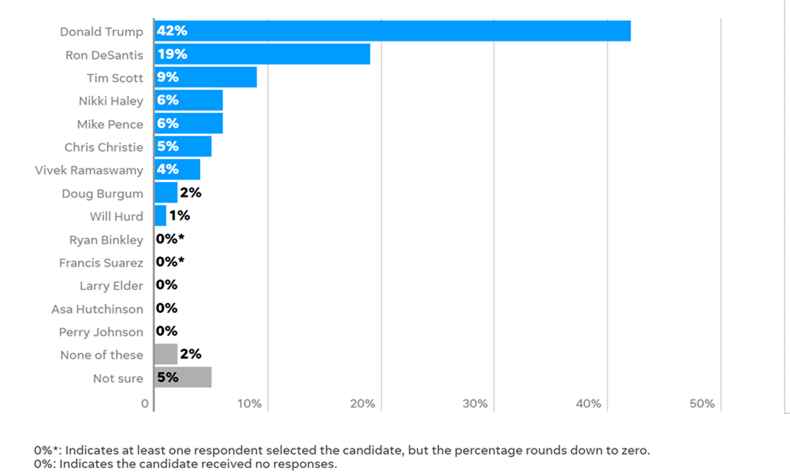
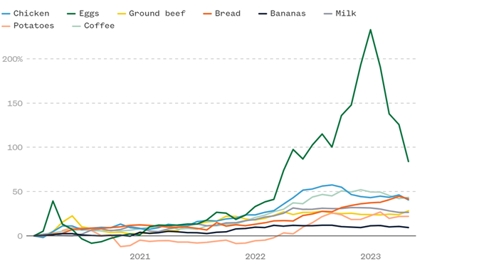
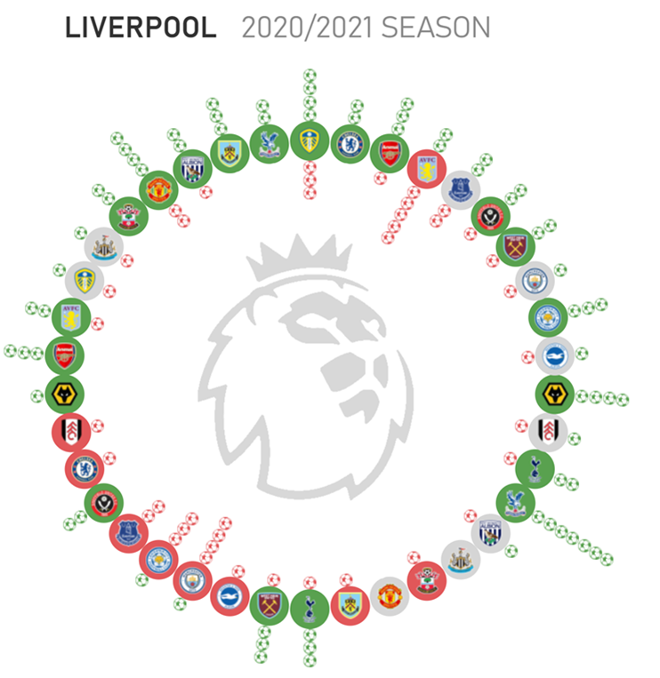

IS 445 - ACG/ACU: Data Visualization - Fall 2023
===============================================
Assingment 1
-----------------------
Student: Christopher Mujjabi
----------------------------
**Date: August 27, 2023**

### Instructions
1. Identify three visualizations in pop culture -- not academic literature. This could be, for instance, from:
     - Movies / TV / Music videos
     - Everyday life
     - Advertisements
2. Describe each one in detail
     - Where did the data come from?
     - Is the data quantitative, qualitative, categorical, etc?
     - How was the data processed before being displayed?
     - What method was used to display that data?
3. Replicate the visualization with different, but similarly "shaped," data
     - By hand is acceptable
     - Computational methods should include source code

## Visualization 1
The image below was obtained from a newspaper called the Des Moines Register, reporting the NBC News Iowa caucus polls casted by 406 "likely 2024 republican caucusgoers, between August 13th to 17th.  

The visualization was produced using quantitative data (numbeer of votes casted for an individual candidate). The raw data for each individual candidate was then processed and presented as a percentage of the total votes cast in the poll. The data was displayed used bargraphs, where each bar represented an individial candidate. I liked how they used an asterics to distinguise the candidates who 0 votes and candidates with a few votes but their processed data rounded to zero. 

I replicated the visualization by hand, using a dataset showing car model preferences by the people in the state of illinois. It was quite easy to reconstruct the idea, but hard to manually space the bars to be equidistant from each other as presented in the orginal image. 
## Visualization 2
The visualization below was obtained from NBC news published on July 12, showing the impact of inflation on the prices of certain groceries, particularly prices of agricultural produce such as eggs, beef, chicken and others. The visualization shows the trend of how prices have increased from 2021 to 2023. 

The data used for this visualization is quantitative, obtained from the historical monthly prices of specific food items studied. I belive that daily data was obtained, and averaged for each month to obtain the montly price of each item. 
The visualization was presented using a line graph, which, in my opinion is the best way to visualize trends or changes over a period of time.

I recreated the visualization by hand, and tried to present a similar phenomenon. My visualization presents the trend of wildfires for the past 2 years in different countries. The visualization shows that Canada has had an exponential increase in wildfires in 2023 compared to other countries where wildfires are common. It was easy to reconstruct the image but hard to redraw the exact increments with high accuracy. However, the general trend or pattern showing an increase from 2021 to 2023 was easy to reconstruct by hand. 

## Visualization 3

