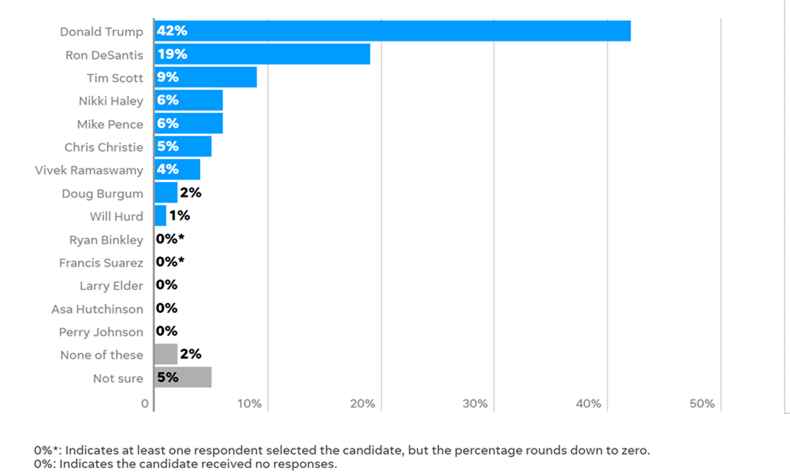
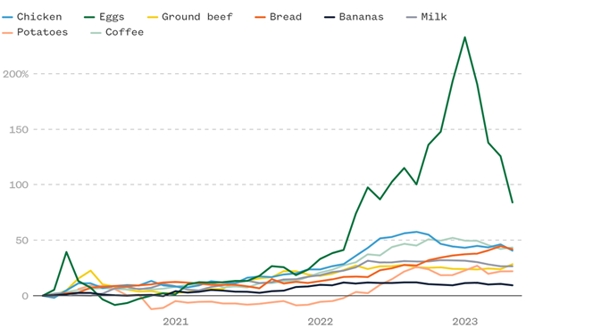
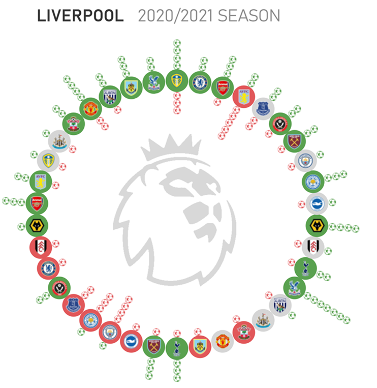

IS 445 - ACG/ACU: Data Visualization - Fall 2023
===============================================
Assignment 1
-----------------------
Student: Christopher Mujjabi
----------------------------
**Date: August 27, 2023**

### Instructions
1. Identify three visualizations in pop culture -- not academic literature. This could be, for instance, from:
     - Movies / TV / Music videos
     - Everyday life
     - Advertisements
2. Describe each one in detail
     - Where did the data come from?
     - Is the data quantitative, qualitative, categorical, etc?
     - How was the data processed before being displayed?
     - What method was used to display that data?
3. Replicate the visualization with different but similarly "shaped" data
     - By hand is acceptable
     - Computational methods should include source code

## Visualization 1
The visualization below was obtained from a newspaper called the Des Moines Register, reporting the NBC News Iowa caucus polls cast by 406 "likely 2024 Republican caucusgoers between August 13th to 17th.  

The visualization was produced using quantitative data (number of votes cast for an individual candidate). The raw data for each individual candidate was then processed and presented as a percentage of the total votes cast in the poll. The data was displayed using bar graphs, where each bar represented an individual candidate. I liked how they used an asterisk to distinguish the candidates who had 0 votes and candidates with a few votes, but their processed data rounded to zero. 

I replicated the visualization by hand, using a dataset showing car model preferences by the people in the state of Illinois. It was quite easy to reconstruct the idea but hard to manually space the bars to be equidistant from each other, as presented in the original image. 
## Visualization 2
The visualization below was obtained from NBC News and published on July 12, showing the impact of inflation on the prices of certain groceries, particularly prices of agricultural produce such as eggs, beef, chicken and others. The visualization shows the trend of how prices have increased from 2021 to 2023. 

The data used for this visualization is quantitative, obtained from the historical monthly prices of specific food items studied. I believe that daily data was obtained and averaged for each month to obtain the monthly price of each item. 
The visualization was presented using a line graph, which, in my opinion, is the best way to visualize trends or changes over a period of time.

I recreated the visualization by hand and tried to present a similar phenomenon. My visualization presents the trend of wildfires for the past two years in different countries. The visualization shows that Canada has had an exponential increase in wildfires in 2023 compared to other countries where wildfires are common. It was easy to reconstruct the image but hard to redraw the exact increments accurately. However, the general trend or pattern showing an increase from 2021 to 2023 was easy to reconstruct by hand. 

## Visualization 3
The visualization below was obtained from a blog created by a Toan Hoang, who creates tutorials about data viz in Tableau, and most importantly, a soccer fan. I was interested in this particular visualization becuase I too am a soccer fan and support liverpool in the english premier league. 
The visualization summaries the perfomance of Liverpool during the 2020 - 2021 premier league season and displays the goals scored and goals conceded in every single match of the season. The green ball on the outside represent the goals scored while the red balls in the inside represent the goals conceded.

The data presented is quantitative and was obatained from adding up the total number of goals scored and total number goals conceded by Liverpool for each one of the 38 games played during the 2020-2021 season. The data was not processed since the circles represent the raw data (goals scored in a particular match). The data was presented in a circle dot chart, which for this particular sport, would be ideal to present raw data given that there are fewer chances of scoring or conceding huge number of goals in a single match. This chart therefore can not be used for certain sports such as football, where the points obtained in a single game can not easily be presented as circles dots.

I replicated the image by hand as shown below, but found it difficult to mantain the shape and size of each soccer ball that represents the goals scored or conceded. 

