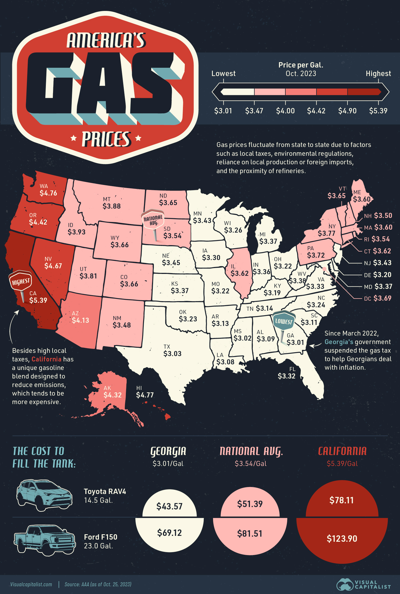

IS 445 - ACG/ACU: Data Visualization - Fall 2023
===============================================
Visualization Report 10
-----------------------
Student: Christopher Mujjabi
----------------------------
**Date: November 6, 2023**

The visualization titled **Gas Prices in Every U.S. State** was obtained from the visual capitalist [website](https://www.visualcapitalist.com/mapped-gas-prices-in-every-u-s-state/), reported by Niccolo Conte on  October 25, 2023. The visualization is a map of the U.S. showing the variations in gas prices among different states as of October 25, 2023, and it was generated using data from the American Automobile Association (AAA). 

The article mentions that gas prices in the U.S. vary significantly by state, influenced by factors like local taxes, proximity to refineries, and environmental regulations. Therefore, we observe in the visualization that states near major refineries like Texas tend to have lower prices; West Coast states, particularly California, experience higher costs due to higher taxes and specialized, pricier fuel blends to reduce emissions. 

I like this visualization because it uses distinct colors to show regions with different gas prices, where states with high gas prices are red, and states with low prices are white. It was interesting to see that Illinois has the highest gas prices in the midwestern states. I would have liked to see the variation of prices within states by hovering over the counties of each state on the map. I think the average state prices presented in the visualization are highly influenced by gas prices in the metropolitan cities.

