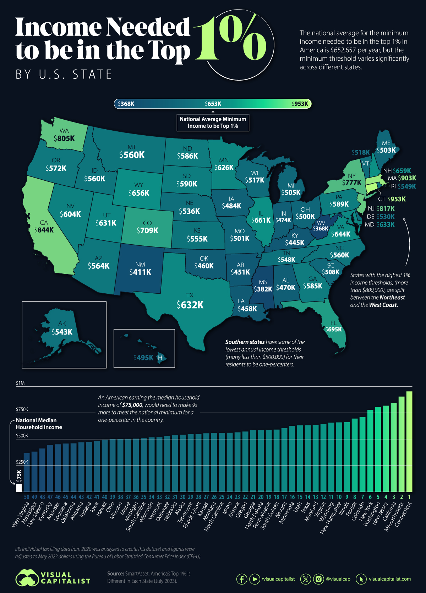

IS 445 - ACG/ACU: Data Visualization - Fall 2023
===============================================
Visualization Report 11
-----------------------
Student: Christopher Mujjabi
----------------------------
**Date: November 13, 2023**

The visualization titled "Income Needed to be in the top 1% By U.S. States" was obtained from the visual capitalist [website](https://www.visualcapitalist.com/mapped-the-top-1-percent-in-each-u-s-state/) reported by Pallavi Rao on September 25, 2023. The data used to generate the visualization was obtained from SmartAsset, which is a personal finance advisory services company. 

The objective of the visualization is to illustrate the income disparities across U.S. states by showcasing the income thresholds required to be part of the top 1% in each state. Connecticut has the highest threshold at nearly $953K annually, and Massachusetts follows closely at $903K. West Virginia has the lowest income requirement of $368k. 

I liked how the visualization contracts these income requirements to the national median household income of $74k. This way, the visualization exposes the huge income disparities in the U.S. For example, an average American household earning the national median of $75k has to increase its income by ninefold to meet the national minimum requirement to be in the top 1%. The visualization also uses an easy-to-read color scheme that shows a gradient transitioning from shades of blue, representing lower income requirements, to light green/yellow, indicating higher income thresholds. 

