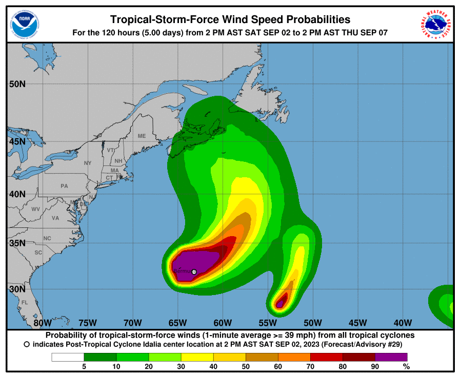

IS 445 - ACG/ACU: Data Visualization - Fall 2023
===============================================
Visualization Report 2
-----------------------
Student: Christopher Mujjabi
----------------------------
**Date: September 07, 2023**

The visualization below was published by the National Hurricane Center (NHC) website on September 02, 2023, studying the development of the tropical cyclone Idalia and its probability of turning into a hurricane. The Visualization shows the probabability of surface wind speeds equal or greater than 39 mph, sustained for an average of 1 minute. The wind speed probababilities estimates were based on the NHC official wind intensity and radii forecast during the past hurricae occurences in the recent years. Therefore, wind speed and intensity data was meausured in 12 hour intervals for 120 ours (5 days) and converted into probability data displayed in the visualization. 

I liked the color choice used in the visualization, to indicate areas in danger and areas with less probability of tropical storm occurence. Areas marked with red colors had higher probabability of experiencing tropical storms or even hurricane, than areas in ligher colors. Regions in the east were less prone to the storm than regions on the west, which coincide with the actual occurence of hurricane Idalia and the regions it impacted. 

However, I think the visualization would best be presented as an animated graph to track the incidence of the storm at each measured time point. This would give a better understaning of where the storm started and the direction of where is is heading, than only presenting a snapshort of a single time period. 

