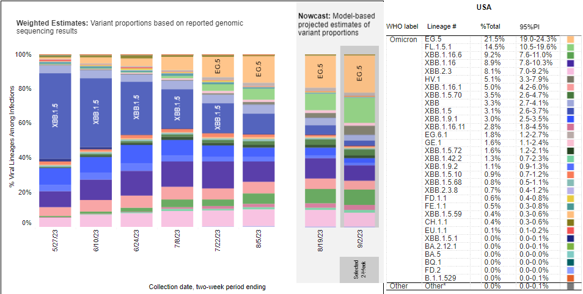

IS 445 - ACG/ACU: Data Visualization - Fall 2023
===============================================
Visualization Report 3
-----------------------
Student: Christopher Mujjabi
----------------------------
**Date: September 15, 2023**

The visualization below was published on the Nebraska Medicine [website](https://www.nebraskamed.com/COVID/what-covid-19-variants-are-going-around) on September 7, 2023 showing the current  dominant Covid-19 variants in the United States, following the recent resurgence of the covid infections. 

There are currently more than 5,772 patients hospitalized in the United States per week, with 15% of those being ICU patients. The most recent data on the test positivity rate is from the week of June 2-8, which was 7.2%. When test positivity is above 5%, transmission is considered uncontrolled.

Since many are using home tests that are not reported through public health or are not testing at all, the official case counts underestimate the actual prevalence of COVID-19.

Currently, the dominant variant nationwide is EG.5, with 21.5% of cases, followed by FL.1.5.1, with 14.5% of cases, and XBB.1.16.6 with 9.2% of cases. "The original omicron variant is gone now," says Dr. Rupp. "Currently subvariants of omicron are circulating, including EG.5, XBB.1.5, and XBB.1.16.

When you receive a COVID-19 test, you won't find out which variant caused your infection. That's because COVID-19 tests only detect the presence of the virus – they don't determine the variant.

Genomic sequencing looks at the genetic code of the virus to determine which variant caused the infection.

Nebraska DHHS sequences test samples after a positive test is identified and reports the total percentage of each variant every two weeks.

