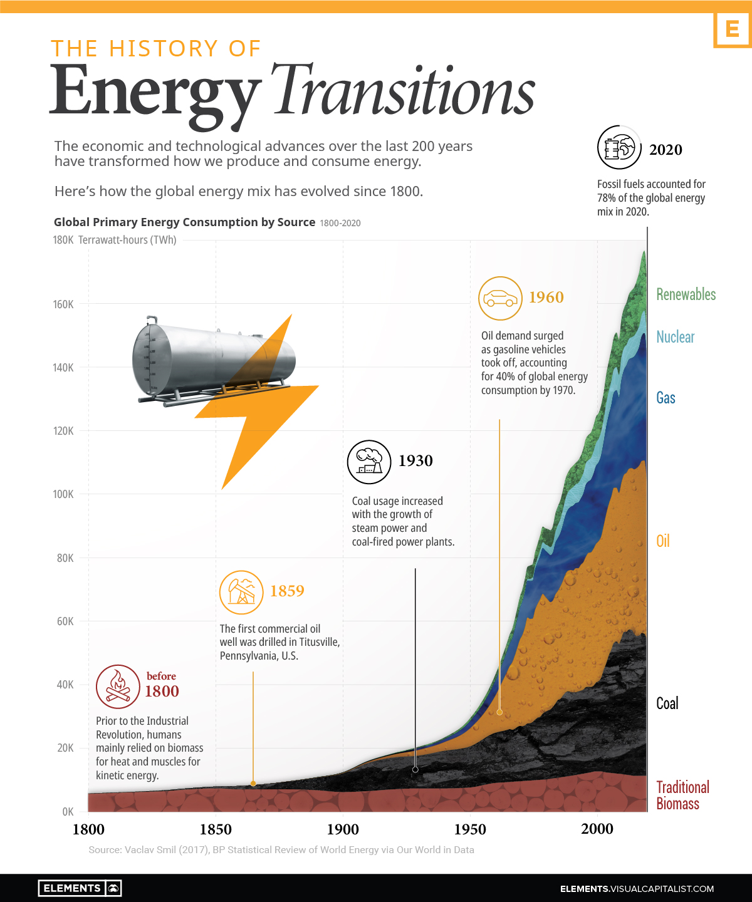

IS 445 - ACG/ACU: Data Visualization - Fall 2023
===============================================
Visualization Report 6
-----------------------
Student: Christopher Mujjabi
----------------------------
**Date: October 9, 2023**

The visualization shows the history of global energy use and transitions, published by Govind Bhutada on April 8, 2022, on the visualcapitalist [website](https://www.visualcapitalist.com/visualizing-the-history-of-energy-transitions/) and obtained on September 28th, 2023. 

The visualization shows the timeline of global energy production and consumption and how energy use transitioned from the traditional use of raw biomass in the 1800s to the current use of renewable energy sources. 

I liked the use of different colors to distinguish between energy sources and how this transition ranges from brown/black (Biomass and coal), symbolizing environmentally unfriendly sources, to green (nuclear and renewable) to represent more sustainable and environmentally friendly sources. 

What was unclear was that I didn't understand whether this visualization was a stacked graph showing the cumulative sum of energy sub-divided into the different forms of energy consumed. For example, in the Year 2000, was the renewable energy consumption 20K TWh ( 160k - 140K), or was it a total of 160K TWh? I also expected the amount of non-renewable energy sources to be reduced with time due to the emergence of renewable sources. Still, based on the visualization, all energy sources follow an increasing trend. I don't know if the data shows a similar trend or if the visualization misrepresents the data. 

