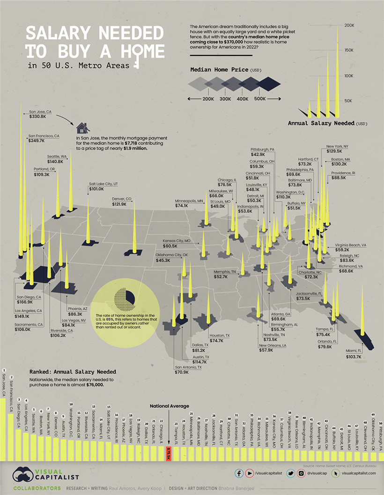

IS 445 - ACG/ACU: Data Visualization - Fall 2023
===============================================
Visualization Report 7
-----------------------
Student: Christopher Mujjabi
----------------------------
**Date: October 15, 2023**

The visualization titled **"The Salary You Need to Buy a Home in 50 U.S. Cities"** was published on August 1, 2022 by Avery Koop on the Visual Capitalist [website](https://www.visualcapitalist.com/mapped-the-salary-you-need-to-buy-a-home-in-50-u-s-cities/). 

One of the primary measures of one's potential to achieve the "American Dream" is their ability to become a homeowner. However, homeownership largely depends on one's income, which essentially determines if they qualify for a mortgage and the mortgage amount. The visualization graphically maps out the annual income required for home ownership in 50 different U.S cities, raising the question on how realistic and is the American Dream given the average national income and the income requiement needed to achieve it. 

I liked the visualization because it makes such an important comparisons in home prices, and average income depending on the region of the U.S one lives in. This essentially shows us the cost of living of a given region. For example we can see a huge difference between the cost of a median home in the midwest cities and the price of the same home on the west coast. 

I didnt like the color gradient used to depict home prices since it difficult to put a value to some of the colors provided in the map. The scale of these colirs also has a 100,000 dollar range, which is a huge value. The yellow bars used to show salary requirements in each city were helpful, but might also need be easily interpreted if the actual value wasnt proivded on each bar. 

I also think that average income in each state or in the presented metro cities should be provided as the real measure of affordability of a home in the given city. Without this information, we can not evaluate affordability of homes in these cities. 

