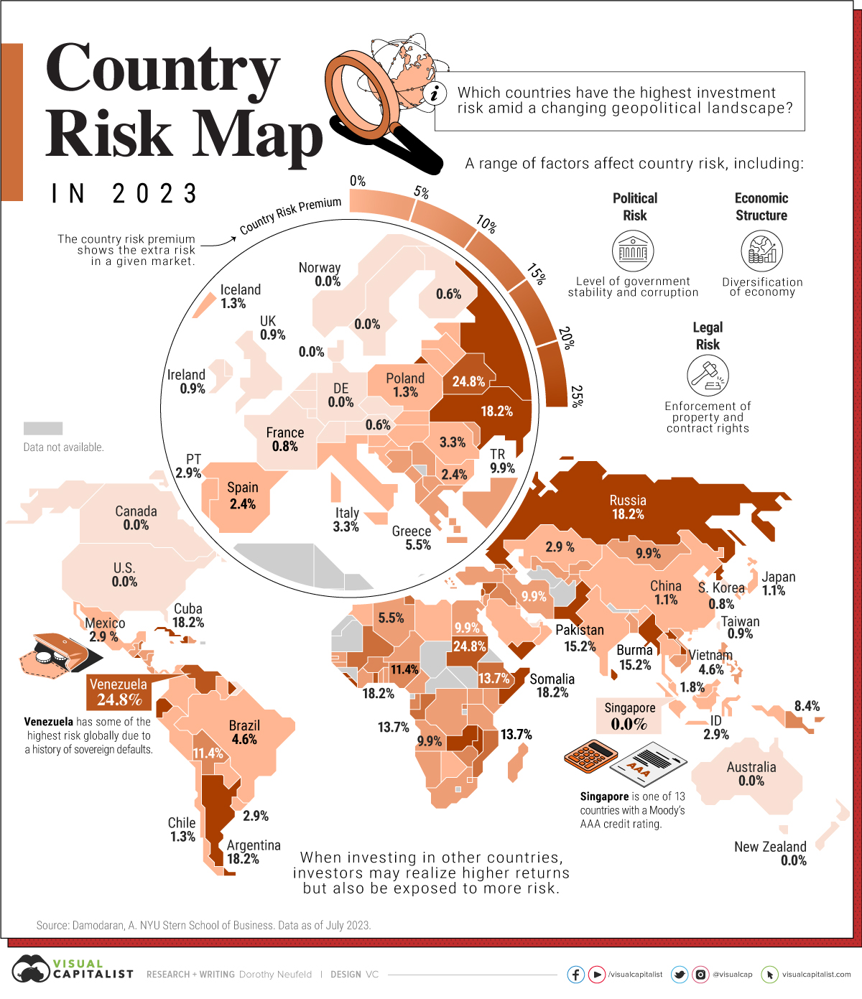

IS 445 - ACG/ACU: Data Visualization - Fall 2023
===============================================
Visualization Report 8
-----------------------
Student: Christopher Mujjabi
----------------------------
**Date: October 20, 2023**

The visualization below, titled **"Country Risk Map in 2023"** was published by Dorothy Neufeld on October 9, 2023, on the visual capitalist [website](https://www.visualcapitalist.com/investment-risk-by-country-map/). 

The visualization uses financial analysis data reported by Aswath Damodaran from New York University's Stern School of Business to assess the risk of making financial investments in different countries worldwide as of 2023. The risk assessment (country risk premium) uses specific determinants or factors, such as the political, legal and economic stability of a given country, using the U.S. as a reference/standard.

According to the visualization, the highest-risk countries, including Belarus, Lebanon, Venezuela and Sudan, which face significant challenges such as conflicts, hyperinflation, and corruption. In contrast, the lowest-risk countries, including several European nations, Singapore, and New Zealand due to their high benefit from AAA-rated government bonds, low corruption, and strong property rights protections. 

I liked using a color gradient to represent the risk level across all countries, where the thicker the color, the riskier the country. However, sometimes, it's difficult to differentiate risk levels if specific risk values are not provided in the map. 
I also didn't like the magnification of the European countries, which doesn't preserve the scaling and size of the map. This shows a level of bias in data delivery since it focuses on particular countries rather than others. I also didn't understand why certain countries were rated as 0% risk since there is no such thing as no risk in business/investment. However, I am an agronomist and not an international financial analyst.  

