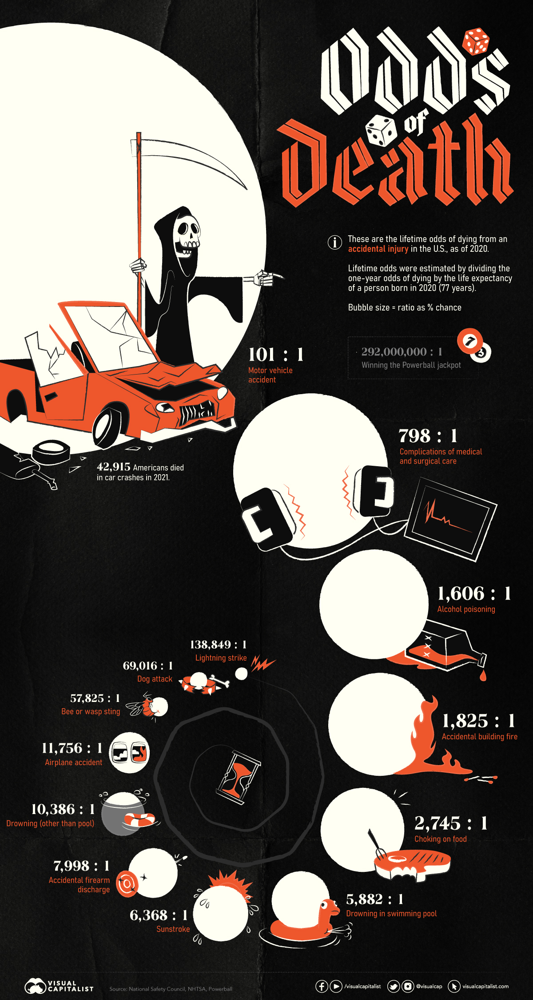

IS 445 - ACG/ACU: Data Visualization - Fall 2023
===============================================
Visualization Report 9
-----------------------
Student: Christopher Mujjabi
----------------------------
**Date: October 29, 2023**

The Visualiation titled "Visualizing the Odds of Dying from Various Accidents" was obtained from the visual capitalist [website](https://www.visualcapitalist.com/visualizing-the-odds-of-dying-in-accidents/), published by  on January 27, 2023. The visualization was generated using data from the U.S. National Safety Council to illustrate the lifetime odds of dying from different accidents through informative data visualization and comparisons.

 It presents a range of incidents, from motor vehicle accidents to drowning and accidental firearm discharge, each with their respective odds of death. The visualization also offers comparisons to provide context, such as contrasting the likelihood of dying in an airplane accident versus winnng the Powerball lottery. 

As we're in the midst of the Halloween season, I thought this visualization crafts a frightening tale that was perfectly in tune with the spirit of the spooky season.

