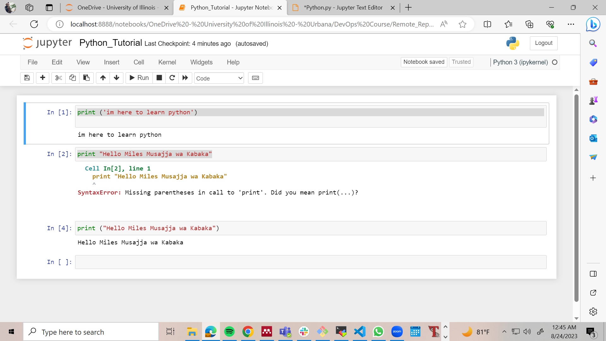

# Intro to Python

## What is python?
Most popular programming language used by soft ware companies like google. 
It has fairly easy syntax therefore easier to learn. 

It is used for many different applications including:
- Websites' backend code - The code that runs on your server (Front end code is the code that runs on the device like a phone or a laptop)
- Data analysis and research purposes. 

## Installing Python
IDE - Integrated Development Environment. Is an environment that is used by programmers to test the program after building it in python. 
Debugger: Helps you to det rid of bugs

### Jupyter Notebook?
Is an alternative environment for writing and testing your program quickly instead of using the traditional IDE. Usually used in research and data analysis purposes. Simple to install using anaconda

#### 2 components of jupyter notebook
- JN server. The window on the left, if you close it, JN will close.
- Brower (User Interface): This can be chrome, safari, firefox etc, that is connected to the server. The code is written here  but executed in the server. This is like the GUI. 

Go to [ANACONDA](https://www.anaconda.com/download#downloads) and select your operating system (Windows, linux, Mac) to download the corresponding anaconda distribution. This process takes a while. 

To lauch Jupyter, Launch an application called *Anaconda Navigator*, find jupyter notebook and launch. 

## Creating your first program
Launch notebook and it will open in the browser. Select your working directory and start a project by selecting "New"

You can start typing python scripts as shown below.

This is called a string. 

### What are variables?

