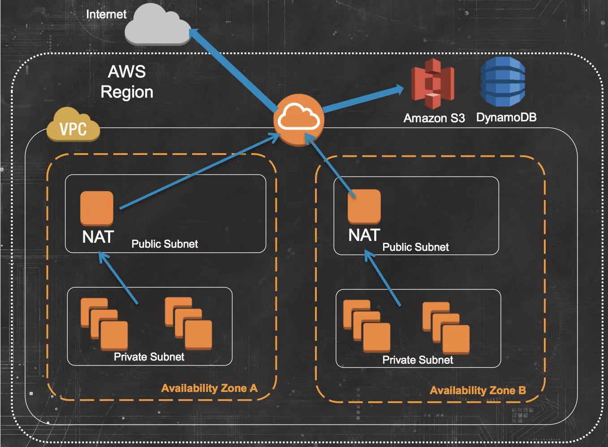

# Virtual Private Cloud (VPC)

This is a virtual network dedicated to your AWS account. It allows you to logically isolate resources like virtual machines, databases, and other services within the AWS cloud.
A VPC CIDR block, in the context of cloud computing, specifically within services like Amazon Web Services (AWS), refers to the Classless Inter-Domain Routing (CIDR) block assigned to a Virtual Private Cloud (VPC).

CIDR block: A CIDR block is a range of IP addresses expressed in CIDR notation. CIDR notation combines an IP address with its associated network prefix, written as "address/prefix length." For example, "192.168.0.0/16" represents a block of IP addresses ranging from 192.168.0.0 to 192.168.255.255.

VPC CIDR block: This is the range of IP addresses that you specify when you create a VPC. It determines the size of the VPC's private IPv4 address range. All resources within the VPC will use IP addresses from this range. For example, if you specify a VPC CIDR block of "10.0.0.0/16", it means that your VPC can have up to 65,536 (2^16) private IP addresses, ranging from 10.0.0.0 to 10.0.255.255.

### What does the slash mean (/8, /16/ 32)

In CIDR notation, a /16 subnet represents a block of IPv4 addresses where the first 16 bits are fixed, and the remaining 16 bits can vary.

To calculate the number of IP addresses in a /16 subnet:

The fixed portion consists of 16 bits.
The variable portion consists of the remaining 16 bits.
The formula to calculate the number of addresses in a subnet is 2^(32 - subnet_mask).

For a /16 subnet:

Fixed bits: 16
Variable bits: 32 - 16 = 16
So, the number of addresses in a /16 subnet is 2^(32 - 16) = 2^16 = 65,536.

Therefore, a /16 subnet contains 65,536 IPv4 addresses.

/32 indicates a single IPv4 address. It's the smallest possible subnet size.

/8 indicates a block of IP addresses where the first 8 bits of the address are fixed and the remaining 24 bits can vary. This represents a very large address range, encompassing 2^24 (over 16 million) IPv4 addresses.

### Subnets:
A subnet, short for "subnetwork," is a segmented portion of a larger network. It allows you to divide a single network into smaller, more manageable parts.
Subnets are typically defined by their IP address range, which is specified using CIDR notation. For example, a subnet might be defined as 192.168.1.0/24, indicating an IP address range from 192.168.1.0 to 192.168.1.255.
Subnets help in organizing network traffic, optimizing network performance, and enhancing security by logically separating different groups of devices or services within a network.

### Private Subnets:
A private subnet is a subnet within a network that does not have direct access to the internet.

In cloud environments like AWS VPCs, private subnets typically do not have an associated internet gateway, and their instances cannot send or receive traffic directly to or from the internet.

Private subnets are often used to host internal resources that should not be accessible from the public internet, such as databases, application servers, or backend services.
Communication with the internet or other external networks from private subnets usually occurs through a NAT (Network Address Translation) gateway or a NAT instance located in a public subnet.

### Public Subnets:
A public subnet is a subnet within a network that has direct access to the internet.
In cloud environments like AWS VPCs, public subnets typically have an associated internet gateway, allowing instances within the subnet to send and receive traffic directly to and from the internet.

Public subnets are commonly used to host resources that require internet connectivity, such as web servers, load balancers, or bastion hosts.

Instances in public subnets can have public IP addresses or use Elastic IP addresses for direct access from the internet.

While public subnets allow for internet connectivity, security measures such as security groups and network ACLs should be implemented to control access and protect resources from unauthorized access or attacks.

## NAT Gateway

A NAT (Network Address Translation) gateway is a managed AWS service that enables instances within a private subnet to initiate outbound internet traffic while keeping them protected from direct inbound access from the internet.

### Outbound Internet Access: 
Instances within a private subnet typically do not have direct internet connectivity. When these instances need to access resources on the internet (such as software updates or external APIs), their outgoing traffic is routed to a NAT gateway.

### Address Translation: 
The NAT gateway translates the private IP addresses of the instances to its own public IP address before sending the traffic out to the internet. This allows the instances to communicate with external servers using the NAT gateway's public IP address, while their private IP addresses remain hidden from the internet.

By using a NAT gateway, you can enforce tighter security controls on inbound traffic to your private subnet. Since the instances in the private subnet do not have public IP addresses, they are shielded from direct inbound access attempts from the internet, reducing the attack surface.

### Connection to Private Subnet:
- To connect a NAT gateway to a private subnet in an AWS VPC, you must first create the NAT gateway in a public subnet. This public subnet should have an associated internet gateway to provide internet connectivity to the NAT gateway itself.

- Once the NAT gateway is created and associated with the appropriate public subnet, you can configure the private subnet's route table to route outbound traffic destined for the internet to the NAT gateway.
    
- By adding a route in the route table of the private subnet with a destination of 0.0.0.0/0 (indicating all internet-bound traffic) and the target set to the NAT gateway, you instruct instances in the private subnet to send their outbound internet-bound traffic to the NAT gateway for translation and forwarding to the internet.

