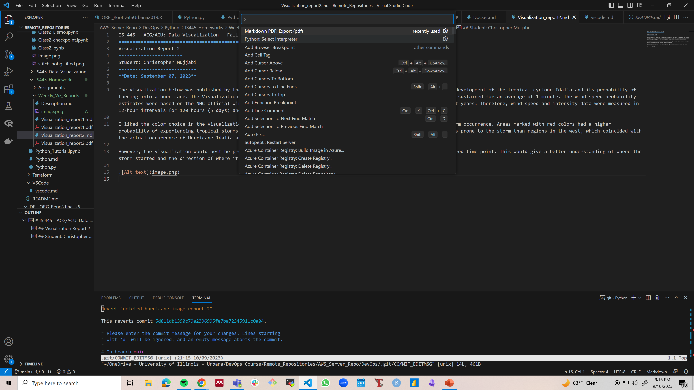

# Tips for VS Code
1. Code . : This is typed in the terminal (bash) in order to open the currect directory in vscode.
2. git rm -r --cached <File name or folder/> : This helps to clear cache so that the intially tracked file gets untracked.
   if you dont run this comman, even if you add the name of the file to gitignore, it will still be tracked. 

# Changing md to pdf
Have to download the pdf extension 
ctr P, search  "markdown pdf extension"

After installig, open any markdown file you want to convert and press "ctr P, >export markdown pdf" as shown in the image below

