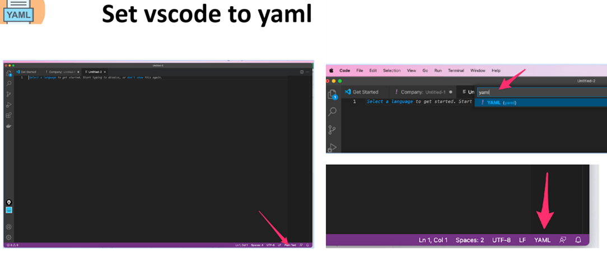

# How to Yaml

Here is the [LINK](https://docs.google.com/presentation/d/1D4AX13d5KymQssgJa_LU__G_eWolD7gJ/edit#slide=id.p1) to Yaml powerpoint. 

This is an I.T language used in the DevOps world. It is a very easy language to learn compared to other languages like bash, python, CSS, C++, Ruby, Javascript, HTML, Java, SQL, PHP, etc. 

Human-readable language. 

Setting yaml on vscode:

## 3 most important concepts in Yaml
1. List
cars:
    - toyota
    - honda
    - nissan
    - lexus 

Cars:
    * toyota
    * honda
    * nissan
    * lexus 

2. Dictionary
A dictionary is difined by the colon.
For example;
Car: toyota
email: eric@gmail.com
color: red blue pink yellow
 If the dictionary has more then one items, you can make it a list

You can also have a list inside a dictionary

EKTech Address:   
      - Street: 1234 Main street
        City: Cypress
        State: TX 
        Zip: 77889

      - Street: 555 David rd 
        City: Raeford 
        State: NC
        Zip: 28376

      - Street: 555 David rd 
        City: Raeford 
        State: NC
        Zip: 28376

3. Indetention
This is the space that defines the parent and children directories. For example, the list of cars below is wronly indented, because honda and toyota are both types of cars, therefore honda cant be under toyota. Therefore, indentention is very important. 

Cars:
    - toyota
        - honda
    - nissan
        - lexus 